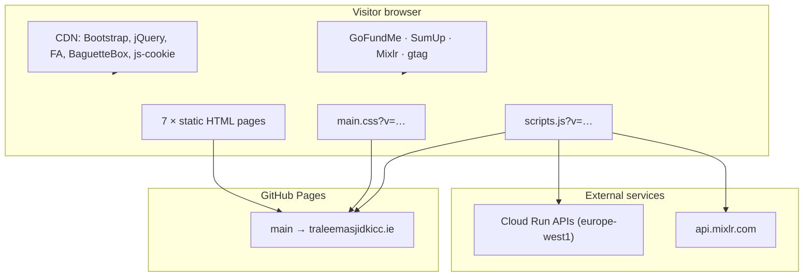
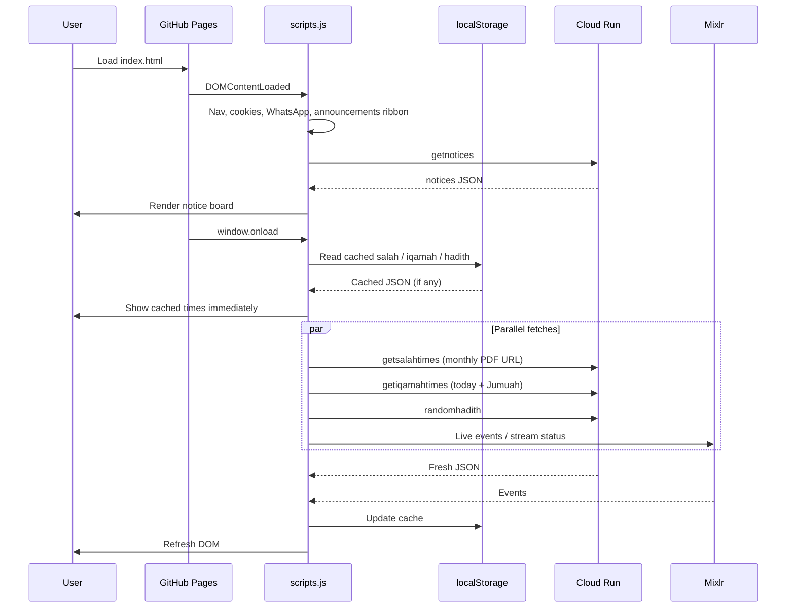
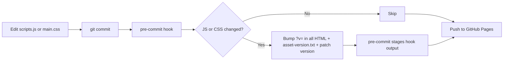

# Tralee Masjid — Kerry Islamic Cultural Centre

<p align="center">
  
</p>

<p align="center">
  <strong>Official website for Kerry Islamic Cultural Centre (Tralee Masjid)</strong><br>
  Serving the religious, cultural, and social needs of Muslims in Tralee and County Kerry, Ireland.
</p>

<p align="center">
  <a href="https://traleemasjidkicc.ie"><strong>traleemasjidkicc.ie</strong></a>
  &nbsp;·&nbsp;
  <a href="https://traleemasjidkicc.ie/prayer-times.html">Prayer times</a>
  &nbsp;·&nbsp;
  <a href="https://traleemasjidkicc.ie/projects.html">New Masjid appeal</a>
  &nbsp;·&nbsp;
  <a href="https://traleemasjidkicc.ie/contact.html">Contact</a>
</p>

<p align="center">
  
</p>

---

## Table of contents

- [About this project](#about-this-project)
- [What the website offers](#what-the-website-offers)
- [Pages](#pages)
- [Tech stack](#tech-stack)
- [Architecture](#architecture)
- [Project structure](#project-structure)
- [Getting started](#getting-started)
- [Development workflow](#development-workflow)
- [JS & CSS asset versioning](#js--css-asset-versioning)
- [Testing](#testing)
- [External APIs & services](#external-apis--services)
- [SEO, PWA & discoverability](#seo-pwa--discoverability)
- [Deployment](#deployment)
- [Troubleshooting](#troubleshooting)
- [AI assistant context](#ai-assistant-context)
- [License](#license)

---

## About this project

This repository powers the public website for **Kerry Islamic Cultural Centre (KICC)**, commonly known as **Tralee Masjid**. The site is a **static [GitHub Pages](https://pages.github.com/)** project: HTML, CSS, and JavaScript files are served directly from the `main` branch — there is **no production build step**.

Local development uses **[Gulp](https://gulpjs.com/)** and **[BrowserSync](https://browsersync.io/)** for live reload. Dynamic content (prayer times, announcements, programmes, hadith) is fetched in the browser from **Google Cloud Run** APIs and cached in `localStorage` for resilience.

| | |
|---|---|
| **Live URL** | [https://traleemasjidkicc.ie](https://traleemasjidkicc.ie) |
| **Hosting** | GitHub Pages (`main` branch) |
| **Custom domain** | `CNAME` → `traleemasjidkicc.ie` |
| **Address** | Killerisk Business Centre, Tralee, Co. Kerry V92 N6YR |
| **Email** | [info@traleemasjidkicc.ie](mailto:info@traleemasjidkicc.ie) |
| **Package manager** | **Yarn 4** only (npm is blocked) |

---

## What the website offers

| Feature | Where | How it works |
|---------|-------|--------------|
| **Today's salah & iqamah** | Nav dropdown, homepage deck | Cloud Run `getiqamahtimes` + cache |
| **Full prayer timetable** | [`prayer-times.html`](prayer-times.html) | Day / week / month views, print-friendly PDF sheet |
| **Monthly timetable PDF** | Nav, prayer times page | Cloud Run `getsalahtimes` |
| **Announcements ribbon** | All pages | Cloud Run `getannouncements` |
| **Notice board** | Homepage | Cloud Run `getnotices` |
| **Weekly programmes** | Homepage preview, [`activities.html`](activities.html) | Cloud Run `getmasjidprogrammes` |
| **Daily hadith** | All pages (footer area) | Cloud Run `randomhadith` |
| **Live stream & events** | Homepage, Programmes | [Mixlr](https://traleemasjid.mixlr.com/) API |
| **Donations** | Homepage, [`projects.html`](projects.html) | GoFundMe embed + SumUp card checkout |
| **New Masjid campaign** | [`projects.html`](projects.html) | Progress gallery, blueprints, funding breakdown |
| **Children's madrasa** | [`madrasa.html`](madrasa.html) | Registration via WhatsApp |
| **Kerry Muslim database** | Nav, footer, homepage modal | Microsoft Form — email updates for Muslims in Kerry (not madrasa enrolment) |
| **Contact & directions** | [`contact.html`](contact.html) | Consent-gated Google Maps embed |
| **Add to Home Screen** | Mobile | `site.webmanifest` + Apple meta tags |

<p align="center">
  
  &nbsp;&nbsp;
  
</p>
<p align="center"><em>Planned masjid front elevation and site overview — see the <a href="https://traleemasjidkicc.ie/projects.html">New Masjid appeal</a> for full progress and donation details.</em></p>

---

## Pages

Seven public HTML pages live at the repository root. Navigation labels match what visitors see in the menu.

| Page | File | Nav label | Summary |
|------|------|-----------|---------|
| **Home** | [`index.html`](index.html) | Home | Hero, prayer deck, announcements, notices, programmes preview, Mixlr, hadith, donate |
| **Prayer times** | [`prayer-times.html`](prayer-times.html) | Salah times | Full adhan & iqamah timetable; day, week, and month views; printable sheet |
| **Programmes** | [`activities.html`](activities.html) | Programmes | Weekly schedule, live talks hub, programme cards from API |
| **New Masjid** | [`projects.html`](projects.html) | New Masjid | Lillah appeal, GoFundMe progress, SumUp, construction photos & blueprints |
| **About** | [`about.html`](about.html) | — | History since 1988, vision, team |
| **Madrasa** | [`madrasa.html`](madrasa.html) | Madrasa | Evening Islamic school for children |
| **Contact** | [`contact.html`](contact.html) | Contact | Imams, management, map, phone, WhatsApp, email |

Footer links also include **Salah timetable** → `prayer-times.html`.

### Error pages

Three themed error pages share the site nav, footer, and cookie consent. They are **not** listed in the main menu or `sitemap.xml`, and use `noindex, nofollow`.

| File | When visitors see it | Summary |
|------|----------------------|---------|
| [`404.html`](404.html) | GitHub Pages serves this for any missing URL | “Page not found” with links home, salah times, contact, and popular pages; shows the requested path when served for a bad link |
| [`403.html`](403.html) | Only when opened directly or mapped by a future host | “Access restricted” |
| [`500.html`](500.html) | Only when opened directly or mapped by a future host | “Something went wrong” |

GitHub Pages **only** auto-serves `404.html`. The 403 and 500 pages are ready if the site moves to infrastructure that can map HTTP status codes.

Error pages use **root-relative** asset and link paths (`/assets/...`, `/contact.html`) so styles and scripts still load when `404.html` is shown for a deep URL such as `/some/missing/page`.

**Regenerate** after nav, footer, or cookie-consent markup changes on `contact.html`:

```bash
yarn build:error-pages
```

Generator: [`scripts/build-error-pages.js`](scripts/build-error-pages.js). Styles: `.page-error` / `.error-*` in `assets/css/main.css`.

---

## Tech stack

| Layer | Technology |
|-------|------------|
| **Markup** | Static HTML5, `lang="en-GB"`, Bootstrap 4.3 grid |
| **Styles** | Stable CSS file (`main.css`) — layout, theme, motion, page sections; cache-busted via `?v=` |
| **Logic** | Stable JS file (`scripts.js`, ~11 400 lines, IIFE, ES6+) |
| **Icons** | Font Awesome 6.2 (CDN) |
| **Gallery** | BaguetteBox 1.10 (CDN) |
| **Cookies** | js-cookie 3.0 (CDN) |
| **Local dev** | Gulp 4 + BrowserSync (port **3000**) |
| **E2E tests** | Playwright 1.60 (Microsoft Edge) |
| **Analytics** | Google Analytics `G-3H9CDDS71D` (consent-gated) |
| **Deployment** | GitHub Pages — no CI build; files served as committed |

**Intentionally not used:** React, Vue, bundlers, TypeScript, or a production transpilation step.

---

## Architecture

### High-level diagram



### Homepage request flow

When someone opens the homepage, the single app script runs in two phases:



### Client-side init timing

| Event | All pages | Page-specific extras |
|-------|-----------|----------------------|
| **`DOMContentLoaded`** | Footer year, cookie bar, announcements ribbon, nav salah panel, mobile nav, section nav dock, consent embeds, WhatsApp, back-to-top | **Home:** notices · **Prayer times:** timetable UI + motion |
| **`window.onload`** | Salah URL, iqamah times, hadith, fundraiser progress | **Home / Programmes:** Mixlr + programmes · **New Masjid:** BaguetteBox gallery · **Prayer times:** timetable refresh |

---

## Project structure

```
traleemasjidkicc.github.io/
├── index.html                 # Homepage
├── prayer-times.html          # Full salah timetable
├── activities.html            # Programmes
├── projects.html              # New Masjid donation campaign
├── about.html
├── madrasa.html
├── contact.html
├── 404.html                   # Custom not-found page (GitHub Pages auto-serves)
├── 403.html                   # Access denied (standalone; not auto-served on GitHub Pages)
├── 500.html                   # Server error (standalone; not auto-served on GitHub Pages)
│
├── scripts/
│   └── build-error-pages.js   # Regenerates 404/403/500 from contact.html chrome
│
├── assets/
│   ├── css/
│   │   └── main.css           # Stylesheet (edit in place)
│   ├── js/
│   │   └── scripts.js         # App logic (~11 400 lines)
│   ├── asset-version.txt      # Current ?v= timestamp (hook-managed)
│   └── images/
│       ├── brand/             # Logo, Bismillah, GoFundMe QR
│       ├── backgrounds/       # Hero backgrounds
│       ├── photos/            # Building & site photography
│       ├── blueprints/        # Renders, plans, construction updates
│       ├── team/              # Team photos
│       └── ui/                # UI illustrations
│
├── tests/
│   ├── helpers/site.js        # Shared Playwright helpers
│   ├── about.spec.js
│   ├── activities.spec.js
│   ├── contact-form.spec.js
│   ├── cookie-consent.spec.js
│   ├── errors.spec.js
│   ├── homepage.spec.js
│   ├── madrasa.spec.js
│   ├── mobile-nav.spec.js
│   ├── prayer-times.spec.js
│   ├── projects.spec.js
│   ├── responsive.spec.js
│   ├── seo.spec.js
│   └── site-chrome.spec.js    # 142 Playwright tests total
│
├── robots.txt                 # Crawler rules + sitemap URL
├── sitemap.xml                # All public pages for search engines
├── site.webmanifest           # PWA / Add to Home Screen metadata
├── CNAME                      # traleemasjidkicc.ie
├── gulpfile.js                # Dev server + asset versioning tasks
├── playwright.config.js       # E2E test configuration
├── package.json               # Scripts & devDependencies
├── pre-commit                 # Git hook (copy via yarn setup-hooks)
│
├── AGENTS.md                  # AI agent instructions
├── .cursor/rules/             # Cursor IDE scoped rules
└── .github/copilot-instructions.md
```

---

## Getting started

### Prerequisites

- **[Node.js](https://nodejs.org/)** — LTS recommended
- **[Yarn](https://yarnpkg.com/)** ≥ 4.0.0 — required (`npm` is blocked via `engine-strict` in `.npmrc`)

### 1. Clone and install

```bash
git clone git@github.com:traleemasjidkicc/traleemasjidkicc.github.io.git
cd traleemasjidkicc.github.io

# Clean install from lockfile (also starts dev server via postci)
yarn ci
```

To install **without** auto-starting the dev server:

```bash
yarn install --immutable
```

### 2. Install git hooks (recommended)

Hooks automatically version JS/CSS files when you commit changes:

```bash
yarn setup-hooks
```

This copies `pre-commit` into `.git/hooks/` and removes the retired `post-commit` hook if present.

### 3. Start the dev server

```bash
yarn start
```

Opens **[http://localhost:3000](http://localhost:3000)** with live reload. BrowserSync watches:

- `*.html`
- `assets/css/*.css`
- `assets/js/*.js`

### 4. Verify dependencies (optional)

Confirms `node_modules` matches `yarn.lock`:

```bash
yarn verify
```

---

## Development workflow

### Command reference

| Task | Command |
|------|---------|
| Install dependencies | `yarn ci` |
| Install git hooks | `yarn setup-hooks` |
| Start dev server | `yarn start` |
| Verify lockfile / cache | `yarn verify` |
| Run pre-commit tasks manually | `yarn precommit` |
| Regenerate error pages | `yarn build:error-pages` |
| Commit (hooks run automatically) | `git commit` |
| E2E tests (server must be running) | `yarn test:e2e` |
| E2E with visible browser | `yarn test:e2e:headed` |
| E2E interactive UI | `yarn test:e2e:ui` |
| Open last E2E report | `yarn test:e2e:report` |

### What to edit

| Change type | File(s) | Notes |
|-------------|---------|-------|
| **Page content** | `*.html` at repo root | Preview with `yarn start` |
| **Styles** | `assets/css/main.css` | Hot-reloads in browser via `yarn start` |
| **JavaScript** | `assets/js/scripts.js` | Commit bumps `?v=` if changed |
| **Dependencies** | `package.json`, `yarn.lock` | `yarn upgrade <pkg>`, then test |
| **Ramadan / Eid banner** | `scripts.js` → `isRamadan()` / `isEid()` | Update dates annually (currently 2026) |
| **New public page** | HTML + nav + footer + `sitemap.xml` + SEO `<head>` | Copy meta pattern from an existing page |
| **Error page copy or chrome** | `scripts/build-error-pages.js` → run `yarn build:error-pages` | Do not hand-edit generated nav/footer in `404.html` / `403.html` / `500.html` |
| **Error page styles** | `assets/css/main.css` (`.page-error`, `.error-*`) | Commit bumps `?v=` if CSS changed |

### Important rules

- **Use Yarn only** — not npm.
- **Do not manually edit** `?v=` in HTML `<script>` / `<link>` tags — git hooks bump it on commit.
- **Do not bump** `package.json` version manually — the pre-commit hook patches it when JS or CSS changes.
- With `yarn start`, JS/CSS edits reload without a hard refresh; after commit, a normal reload picks up the new `?v=`.

---

## JS & CSS asset versioning

JavaScript and CSS use **stable filenames** with a `?v=` query parameter so returning visitors always get fresh assets after a deploy.



Example references in HTML (`?v=` changes on commit):

```html
<link rel="stylesheet" href="assets/css/main.css?v=1783882879810">
<script defer type="text/javascript" src="assets/js/scripts.js?v=1783882879810"></script>
```

---

## Testing

### Manual testing

1. Run `yarn start`
2. Open [http://localhost:3000](http://localhost:3000)
3. Check prayer times, announcements, and programmes load (Network tab in DevTools)
4. Test cookie consent → map embed on Contact page
5. Test mobile layout and nav

### Automated E2E (Playwright)

**142 tests** across 13 spec files map to [UAT v2.0 prefixed IDs](docs/tests/active/uat-suite-v2.0.2-2026-07-11.md) (e.g. `NAV-01`, `PT-17`, `PROJ-11`). Shared helpers live in [`tests/helpers/site.js`](tests/helpers/site.js).

| Spec | Primary coverage |
|------|------------------|
| `homepage.spec.js` | Home hero, prayer deck, pillars, donate |
| `mobile-nav.spec.js` | Navbar, mega menus, salah dropdown |
| `cookie-consent.spec.js` | Consent banner, preferences, embed gating |
| `prayer-times.spec.js` | Timetable views, cache-then-fetch (PT-17–19) |
| `projects.spec.js` | New Masjid campaign, GoFundMe, SumUp |
| `contact-form.spec.js` | Form validation, imam CTAs |
| `about.spec.js`, `madrasa.spec.js`, `activities.spec.js` | Static / programmes pages |
| `errors.spec.js` | 404, API degradation |
| `site-chrome.spec.js`, `seo.spec.js`, `responsive.spec.js` | Footer, metadata, layout |

**Locally** — dev server must already be running on port 3000:

```bash
# Terminal 1
yarn start

# Terminal 2
yarn test:e2e
```

`pretest:e2e` fails fast with a clear message if nothing is listening on port 3000.

**In CI** — Playwright starts its own BrowserSync server automatically (see [`playwright.config.js`](playwright.config.js)).

| Command | Purpose |
|---------|---------|
| `yarn test:e2e` | Headless Edge run |
| `yarn test:e2e:headed` | Visible browser |
| `yarn test:e2e:ui` | Playwright UI mode |
| `yarn test:e2e:report` | Open HTML report after a run |

---

## External APIs & services

### Google Cloud Run (`europe-west1`)

All masjid content is fetched client-side and cached in `localStorage`.

| Endpoint | Purpose | Cache key |
|----------|---------|-----------|
| `getsalahtimes-rds3nxm6za-ew.a.run.app` | Monthly timetable PDF/image URL | `salahTimesAssetUrl` |
| `getiqamahtimes-rds3nxm6za-ew.a.run.app` | Monthly iqamah timetables + Jumuah | `iqamah-month-{year}-{month}` |
| `getannouncements-rds3nxm6za-ew.a.run.app` | Site-wide announcements ribbon | `kicc-announcements` |
| `getnotices-rds3nxm6za-ew.a.run.app` | Homepage notice board | `notices` |
| `getmasjidprogrammes-rds3nxm6za-ew.a.run.app` | Weekly programmes (`recordingsLimit=6`) | `masjidProgrammes_programme_active_true_v2` |
| `randomhadith-rds3nxm6za-ew.a.run.app` | Daily hadith | `kicc-random-hadith` |
| `getcampaigns-rds3nxm6za-ew.a.run.app` | Donation campaign progress (GoFundMe totals) | `kicc-campaign-progress` |
| `createcheckout-rds3nxm6za-ew.a.run.app` | SumUp card payment session (homepage + New Masjid) | — |

If a Cloud Run API is temporarily down, the site shows the last cached response where available (content APIs only; checkout is not cached).

### Other third-party services

| Service | Used for |
|---------|----------|
| [Mixlr](https://traleemasjid.mixlr.com/) (`api.mixlr.com`) | Live stream status and upcoming events |
| **GoFundMe embed** | Donation widgets on homepage and New Masjid page |
| **SumUp** via Cloud Run `createCheckout` | Card donations (homepage + projects) |
| **Microsoft Forms** | Kerry Muslim database sign-up (nav, footer, homepage modal) |
| **Google Analytics** (`G-3H9CDDS71D`) | Site analytics (loaded after consent) |
| **js-cookie** (CDN) | Cookie preferences and newsletter modal |
| **Google Maps** (embed) | Contact page map (loaded after functional cookie consent) |

---

## SEO, PWA & discoverability

The site is optimised for search engines and mobile home-screen installation.

| Asset / pattern | Purpose |
|-----------------|---------|
| [`robots.txt`](robots.txt) | Allows crawling; points to sitemap |
| [`sitemap.xml`](sitemap.xml) | Lists all 7 public pages at `https://traleemasjidkicc.ie/` |
| **Per-page `<head>`** | Unique `title`, `description`, `canonical`, Open Graph, Twitter Card |
| **JSON-LD** | `Mosque` / `Organization`, `WebPage`, `BreadcrumbList` (homepage also `WebSite`) |
| [`site.webmanifest`](site.webmanifest) | PWA name, icons, theme colour `#0a8a8e`, `start_url` |
| **Apple meta tags** | Home screen title, standalone mode, touch icon |
| **Root icons** | `favicon.ico`, `apple-touch-icon.png`, `android-chrome-*.png` |

After deploying structural changes, submit the sitemap in [Google Search Console](https://search.google.com/search-console):  
`https://traleemasjidkicc.ie/sitemap.xml`

---

## Deployment

1. Merge or push to the **`main`** branch.
2. GitHub Pages serves static files within a few minutes.
3. Custom domain **`traleemasjidkicc.ie`** is configured via [`CNAME`](CNAME).

There is **no build pipeline** — what you commit is what visitors receive. JS/CSS commits bump `?v=` via hooks, so always commit hook-generated HTML changes together with your edits.

---

## Troubleshooting

| Problem | Likely cause | Fix |
|---------|--------------|-----|
| JS or CSS changes not visible | Browser cache or old `?v=` in open tab | Use `yarn start` for dev; after commit, normal reload; hard refresh only if needed |
| `yarn test:e2e` fails immediately | Dev server not running | Run `yarn start` in another terminal first |
| `npm install` fails | npm is blocked | Use `yarn ci` or `yarn install --immutable` |
| Prayer times show stale data | Cached `localStorage` | DevTools → Application → Local Storage → clear relevant keys |
| Map not showing on Contact | Cookies not accepted | Accept functional cookies in the cookie bar |
| APIs return errors | Backend unavailable | Site falls back to cache; check Network tab for 4xx/5xx |
| Hook did not bump `?v=` | File not staged as changed | Ensure you edited `scripts.js` / `main.css` and run `yarn setup-hooks` |
| Google Search Console “unused verification token” | HTML meta tag present but property verified via DNS/Analytics | Safe to ignore, or remove unused meta tag from `index.html` |

---

## AI assistant context

This repo includes documentation for AI coding tools:

| File | Purpose |
|------|---------|
| [`AGENTS.md`](AGENTS.md) | Primary instructions for Cursor / agents |
| [`.cursor/rules/`](.cursor/rules/) | Scoped rules (overview, JS, HTML/CSS, site links, anchor links, UK dates, build workflow) |
| [`.cursorignore`](.cursorignore) | Excludes `node_modules`, Playwright reports from indexing |
| [`.github/copilot-instructions.md`](.github/copilot-instructions.md) | GitHub Copilot context |

---

## License

[Apache License 2.0](LICENSE)

---

<p align="center">
  
</p>

<p align="center">
  <sub>Kerry Islamic Cultural Centre · Tralee Masjid · County Kerry, Ireland</sub>
</p>
