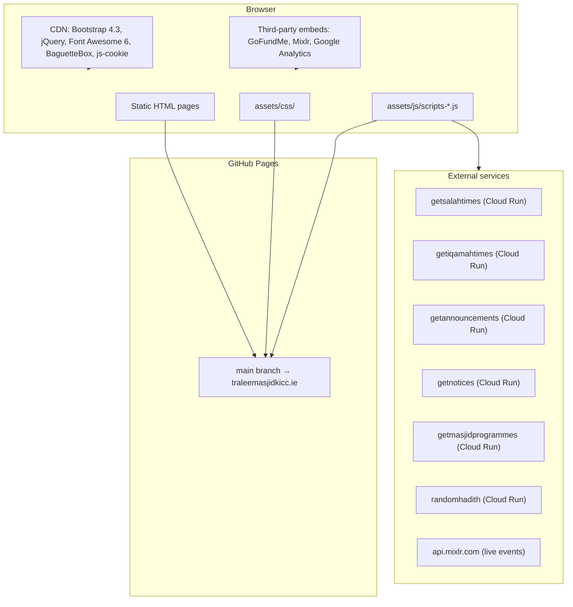
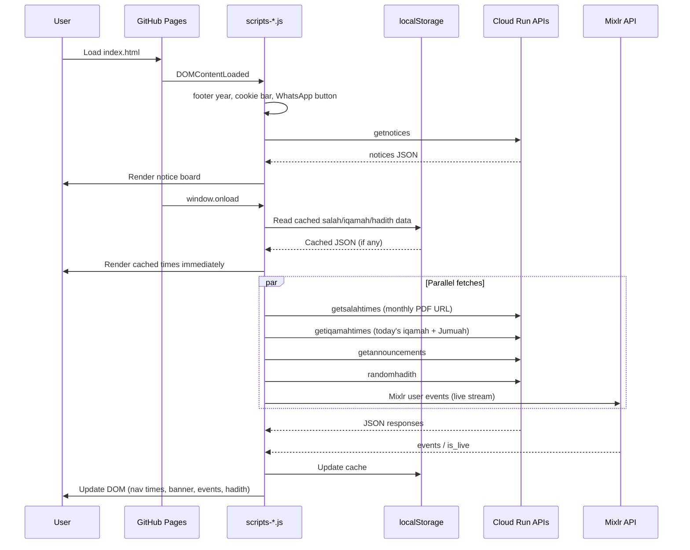
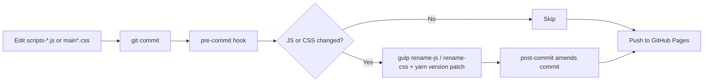

# Tralee Masjid — Kerry Islamic Cultural Centre

Official website for Kerry Islamic Cultural Centre (Tralee Mosque), serving the religious, cultural, and social needs of Muslims in County Kerry, Ireland.

**Live site:** [traleemasjidkicc.ie](https://traleemasjidkicc.ie)

---

## Overview

A static [GitHub Pages](https://pages.github.com/) site built with vanilla HTML, CSS, and JavaScript. No build step is required for deployment — files are served directly from the repository. [Gulp](https://gulpjs.com/) and [BrowserSync](https://browsersync.io/) provide local development with live reload.



---

## Pages

| Page | File | Nav label | Purpose |
|------|------|-----------|---------|
| Home | `index.html` | Home | Prayer times, announcements, notices, live events, hadith, GoFundMe widgets |
| About | `about.html` | — | Centre history, mission, team |
| Activities | `activities.html` | Programmes | Weekly programmes table and cards, live events |
| Madrasa | `madrasa.html` | Madrasa | Islamic school information |
| New Masjid | `projects.html` | New Masjid | Donation campaign, building progress gallery, GoFundMe goal bar |
| Contact | `contact.html` | Contact | Location and contact details |

---

## Architecture

### Request flow (homepage)



### Project structure

```
traleemasjidkicc.github.io/
├── index.html              # Homepage
├── about.html
├── activities.html
├── madrasa.html
├── projects.html           # New Masjid donation campaign
├── contact.html
├── assets/
│   ├── css/
│   │   ├── main.css        # Layout, theme, campaign components
│   │   └── animations.css  # Transitions and keyframes
│   ├── js/
│   │   └── scripts-*.js    # All client logic (~1200 lines, versioned filename)
│   └── images/
│       ├── brand/          # Logo, Bismillah text, decorative quotes
│       ├── backgrounds/    # CSS hero and section backgrounds
│       ├── photos/         # Site and building photography
│       ├── blueprints/     # 3D renders, site plans, construction updates
│       ├── posters/        # Event/announcement posters
│       ├── team/           # Staff/volunteer photos
│       └── ui/             # UI elements (e.g. newsletter signup)
├── gulpfile.js             # Dev server + JS cache-busting
├── package.json
├── pre-commit / post-commit
├── CNAME                   # Custom domain (traleemasjidkicc.ie)
├── site.webmanifest        # PWA manifest
├── AGENTS.md               # AI agent instructions
└── .cursor/rules/          # Cursor IDE rules
```

### JS and CSS asset versioning

JavaScript and main CSS use timestamped filenames (`scripts-{timestamp}.js`, `main-{timestamp}.css`) to bust browser caches when those files change.



> **Do not** manually rename versioned assets or edit `<script src="...">` / `<link href="assets/css/main...">` tags — git hooks handle this automatically.

### Client-side init timing

| Event | Runs on all pages | Homepage only | activities.html | projects.html |
|-------|-------------------|---------------|-----------------|---------------|
| `DOMContentLoaded` | footer year, cookie bar, WhatsApp | notices fetch | — | — |
| `window.onload` | salah URL, iqamah times, hadith | modal, announcements, Mixlr events | events, programmes | BaguetteBox gallery |

---

## Running locally

### Prerequisites

- [Node.js](https://nodejs.org/) (LTS recommended)
- [Yarn](https://yarnpkg.com/) ≥ 4.0.0 (npm is blocked via `engine-strict`)

### Setup

```bash
# Clone the repository
git clone git@github.com:traleemasjidkicc/traleemasjidkicc.github.io.git
cd traleemasjidkicc.github.io

# Install dependencies (frozen lockfile)
yarn ci

# Install git hooks if you have not already
yarn setup-hooks
```

`yarn ci` runs a clean `yarn install --immutable` (Yarn 4 equivalent of `--frozen-lockfile`) and then starts the dev server. To install without starting:

```bash
yarn install --immutable
```

### Development server

```bash
yarn start
```

Opens **http://localhost:3000** with live reload. BrowserSync watches:

- `*.html`
- `assets/css/*.css`
- `assets/js/*.js`

### Verify dependencies

Checks that `node_modules` and the lockfile are in sync and package checksums match:

```bash
yarn verify
```

Runs `yarn install --immutable --check-cache`.

### Git hooks (optional but recommended)

After cloning, install commit hooks so JS assets are versioned on each commit:

```bash
yarn setup-hooks
```

This copies `pre-commit` and `post-commit` into `.git/hooks/` and makes them executable.

---

## Development workflow

| Task | Command |
|------|---------|
| Install dependencies | `yarn ci` |
| Install git hooks | `yarn setup-hooks` |
| Start dev server | `yarn start` |
| Verify node_modules | `yarn verify` |
| Commit (with hooks) | `git commit` — runs asset versioning automatically |

### Editing guide

1. **HTML content** — edit page files directly; preview with `yarn start`
2. **Styles** — edit `assets/css/main.css` or `animations.css`
3. **JavaScript** — edit `assets/js/scripts-*.js` in place; commit normally
4. **Dependencies** — `yarn upgrade <package>`, test locally, commit `yarn.lock`
5. **Ramadan/Eid dates** — update hardcoded dates in `isRamadan()` / `isEid()` annually

---

## External APIs and services

### Google Cloud Run (dynamic content)

All masjid content APIs are fetched client-side from Cloud Run services in `europe-west1`:

| API | Used for |
|-----|----------|
| `getsalahtimes-rds3nxm6za-ew.a.run.app` | Monthly salah times asset URL |
| `getiqamahtimes-rds3nxm6za-ew.a.run.app` | Today's iqamah times and Jumuah schedule |
| `getannouncements-rds3nxm6za-ew.a.run.app` | Homepage announcements banner |
| `getnotices-rds3nxm6za-ew.a.run.app` | Homepage notice board |
| `getmasjidprogrammes-rds3nxm6za-ew.a.run.app` | Activities programmes (table + cards) |
| `randomhadith-rds3nxm6za-ew.a.run.app` | Daily hadith |

Responses are cached in `localStorage` for resilience when APIs are unavailable.

### Other third-party services

| Service | Used for |
|---------|----------|
| `api.mixlr.com` | Live stream status and upcoming events (homepage + activities) |
| GoFundMe embed | Donation widgets on homepage and `projects.html` |
| Google Analytics (`G-3H9CDDS71D`) | Site analytics |
| js-cookie (CDN) | Cookie consent and newsletter modal preferences |

---

## Deployment

Pushing to the `main` branch deploys automatically to GitHub Pages. The `CNAME` file configures the custom domain `traleemasjidkicc.ie`.

No CI build step — static assets are served as committed.

---

## Cursor / AI context

This repo includes files to help AI assistants work effectively:

| File | Purpose |
|------|---------|
| `AGENTS.md` | Primary agent instructions |
| `.cursor/rules/` | Scoped rules (overview, JS, HTML/CSS, build workflow) |
| `.cursorignore` | Excludes `node_modules` from indexing |
| `.github/copilot-instructions.md` | GitHub Copilot context |

---

## License

Apache License 2.0 — see [LICENSE](LICENSE).
