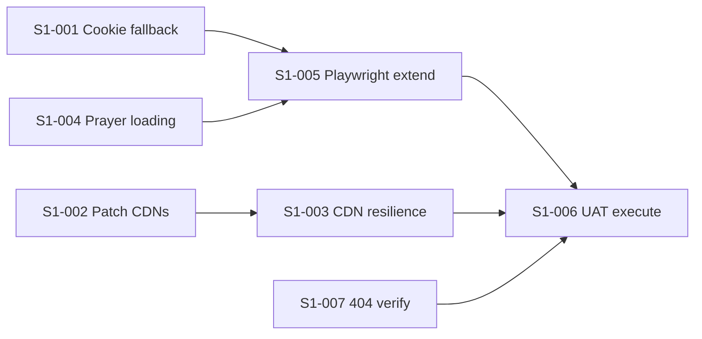

# Sprint 1 — Resilience, dependencies & UAT hardening

**Site version (baseline):** `1.1.138`  
**Sprint target release:** `1.2.0`  
**Sprint goal:** Reduce single points of failure (cookie gate, CDNs, APIs), patch outdated front-end libraries within Bootstrap 4, and complete UAT for failure modes before production sign-off.

**Source:** Code audit findings (June 2026) cross-checked against the [UAT suite v2.0](docs/tests/active/uat-suite-v2.0-2026-06-28.md) and the current codebase.

---

## Status legend

| Status | Meaning |
|--------|---------|
| **Backlog** | Not started; scoped and ready to pick up |
| **Ready** | Dependencies met; can start immediately |
| **In Progress** | Active work |
| **Done** | Implemented in repo; pending UAT or deploy verification |
| **Verified** | Tested on staging/production or covered by automated tests |
| **Deferred** | Acknowledged; planned for a later sprint |
| **Won't Fix** | By design or out of scope |

## Priority legend

| Priority | When to tackle |
|----------|----------------|
| **P0** | Blocks production sign-off or causes total site failure |
| **P1** | High user impact; should complete in Sprint 1 |
| **P2** | Important but can spill to Sprint 2 if capacity is tight |
| **P3** | Polish, planning, or documentation-only |

---

## Sprint 1 backlog

| ID | Title | Priority | Status | Target | Owner |
|----|-------|----------|--------|--------|-------|
| S1-001 | Cookie consent gate fallback | P0 | Backlog | 1.2.0 | — |
| S1-002 | Patch CDN libraries (Bootstrap 4.6, jQuery 3.7, FA 6.7) | P1 | Backlog | 1.2.0 | — |
| S1-003 | CDN resilience — self-host or fallback strategy | P1 | Backlog | 1.2.0 | — |
| S1-004 | Prayer times loading state & cache verification | P1 | Backlog | 1.2.0 | — |
| S1-005 | Extend Playwright — API failure & device cases | P1 | Backlog | 1.2.0 | — |
| S1-006 | UAT execution — third-party & API-down scenarios | P1 | Backlog | 1.2.0 | — |
| S1-007 | Branded 404 page — deploy verification | P2 | Done | 1.1.x | — |
| S1-008 | Formspree quota visibility & upgrade path | P2 | Backlog | 1.2.0 | — |
| S1-009 | Arabic RTL greeting — cross-browser check | P2 | Backlog | 1.2.0 | — |
| S1-010 | SumUp donation — sandbox-limited UAT scope | P2 | Ready | 1.2.0 | — |
| S1-011 | Bootstrap 5 migration plan | P3 | Deferred | 2.0.0 | — |
| S1-012 | End-user authentication | — | Won't Fix | — | — |

---

## Backlog detail

### S1-001 — Cookie consent gate fallback

| Field | Value |
|-------|-------|
| **Priority** | P0 |
| **Status** | Backlog |
| **Target version** | 1.2.0 |
| **UAT refs** | 19–28, 138 |
| **Files** | `assets/js/scripts-*.js` (`setCookieConsentBlocking`, `activateCookieConsentGate`) |

**Problem:** On first visit, `setCookieConsentBlocking(true)` sets `inert` on every `document.body` child except the cookie UI. If app JS fails to load (CDN timeout, network error, ad blocker), the site is completely unusable with no way to accept cookies.

**Acceptance criteria**

- [ ] If `cookie-consent` markup is missing or consent init throws, body children are **not** left permanently inert.
- [ ] Optional: after a configurable timeout (e.g. 8–10 s), release the gate and show a non-blocking banner so core content (prayer times, contact, static pages) remains reachable.
- [ ] Cookie banner and preferences remain keyboard-accessible when the gate is active.
- [ ] Existing consent behaviour unchanged for normal loads (gate still blocks modals/embeds until choice — UAT 25).
- [ ] Playwright test: simulate blocked app script or delayed init; assert page is not permanently inert.

---

### S1-002 — Patch CDN libraries (stay on Bootstrap 4)

| Field | Value |
|-------|-------|
| **Priority** | P1 |
| **Status** | Backlog |
| **Target version** | 1.2.0 |
| **UAT refs** | 1–18, 79, 114–116 |

**Problem:** Bootstrap **4.3.1** (2019), jQuery slim **3.3.1**, Font Awesome **6.2.0**, Popper **1.14.7**, js-cookie **3.0.1**, BaguetteBox **1.10.0** are behind current patch releases within the same major versions.

**Scope (Sprint 1 — patch, not major migration)**

| Library | Current | Target |
|---------|---------|--------|
| Bootstrap | 4.3.1 | **4.6.2** |
| jQuery (slim) | 3.3.1 | **3.7.1** |
| Popper.js | 1.14.7 | **1.16.1** |
| Font Awesome | 6.2.0 | **6.7.2** |
| js-cookie | 3.0.1 | **3.0.8** |
| BaguetteBox | 1.10.0 | **1.13.0** |

**Acceptance criteria**

- [ ] All seven public HTML pages, error pages (via `yarn build:error-pages`), and `scripts/build-error-pages.js` updated with new CDN URLs and **SRI `integrity` hashes**.
- [ ] Migrate Bootstrap CDN from deprecated `stackpath.bootstrapcdn.com` to **jsDelivr** (`cdn.jsdelivr.net/npm/bootstrap@4.6.2/...`).
- [ ] Update Font Awesome fallback URL in `scripts-*.js` (prayer-times print preview).
- [ ] Smoke test: nav dropdowns, modals, cookie consent, notice lightbox, projects gallery, madrasa particles.
- [ ] `yarn test:e2e` passes.

**Out of scope (see S1-011):** Bootstrap 5, jQuery 4, Popper 2, Font Awesome 7.

---

### S1-003 — CDN resilience — self-host or fallback strategy

| Field | Value |
|-------|-------|
| **Priority** | P1 |
| **Status** | Backlog |
| **Target version** | 1.2.0 |
| **UAT refs** | 123, 138 |
| **Depends on** | S1-002 (optional: self-host the versions pinned in S1-002) |

**Problem:** Critical CSS/JS (Bootstrap, jQuery, Font Awesome, js-cookie) loads from external CDNs. Any CDN outage breaks layout, consent, and Bootstrap plugins.

**Options (pick one for Sprint 1)**

1. **Self-host** — Copy minified assets into `assets/vendor/` and reference locally (preferred for resilience).
2. **Dual CDN fallback** — Primary jsDelivr; `<script onerror>` or loader retries cdnjs.
3. **Hybrid** — Self-host Bootstrap + jQuery; keep Font Awesome on CDN.

**Acceptance criteria**

- [ ] Site renders and navigates when primary CDN is blocked (DevTools → block domain).
- [ ] SRI maintained for any remaining CDN tags.
- [ ] Document chosen strategy in `AGENTS.md`.
- [ ] No regression in cache-busting for site-owned `scripts-*.js` / `main-*.css`.

---

### S1-004 — Prayer times loading state & cache verification

| Field | Value |
|-------|-------|
| **Priority** | P1 |
| **Status** | Backlog |
| **Target version** | 1.2.0 |
| **UAT refs** | 9, 34–37, 51–58, 134–135, 138 |
| **Files** | `assets/js/scripts-*.js` (`setSalahTimes`, `initNavSalahPanel`, `localStorage` key `iqamah-today`) |

**Problem:** Nav salah panel and home prayer deck initialise with `—` placeholders. If Cloud Run is slow or fails and cache is empty, users may see dashes with no explanation.

**Acceptance criteria**

- [ ] On cache hit, times appear without flash of `—` where possible (apply cached JSON before fetch completes).
- [ ] On fetch failure with no cache: show visitor-friendly message (not blank dashes forever), e.g. “Prayer times unavailable — try again shortly”.
- [ ] Loading indicator or `aria-busy` on nav panel during first fetch.
- [ ] Stale cache policy documented (e.g. show cached times with “Last updated” if API fails).
- [ ] Manual UAT 138 passes; optional Playwright route mock for failed `getiqamahtimes`.

---

### S1-005 — Extend Playwright — API failure & device cases

| Field | Value |
|-------|-------|
| **Priority** | P1 |
| **Status** | Backlog |
| **Target version** | 1.2.0 |
| **UAT refs** | 138–140, 123 |
| **Baseline** | 55 tests in `tests/` (cookie consent, nav, homepage, prayer times, contact, projects) |

**Problem:** Automated suite covers happy paths well; API-down and some mobile-only flows rely on manual UAT.

**Acceptance criteria**

- [ ] New spec or tests: block Cloud Run iqamah API → graceful nav degradation (mirrors UAT 138).
- [ ] New test: block `api.mixlr.com` → off-air / placeholder (UAT 139).
- [ ] Mobile viewport project or tagged tests for hamburger, cookie banner, contact form (390×844).
- [ ] Optional: cookie-gate timeout release test (pairs with S1-001).
- [ ] CI (`playwright.config.js` webServer) still passes on Edge.

---

### S1-006 — UAT execution — third-party & API-down scenarios

| Field | Value |
|-------|-------|
| **Priority** | P1 |
| **Status** | Backlog |
| **Target version** | 1.2.0 |
| **Deliverable** | Updated Status column in [uat-suite v2.0.1](docs/tests/active/uat-suite-v2.0-2026-06-28.md) |

**Problem:** Core value (prayer times, programmes, donations, contact) depends on Cloud Run, Mixlr, GoFundMe, SumUp, Formspree. Failure modes must be exercised before sign-off.

**Scope**

| Service | Test focus | UAT cases |
|---------|------------|-----------|
| Cloud Run | Prayer times, programmes, notices, announcements, campaigns | 34–39, 51–58, 66–68, 76, 123, 138 |
| Mixlr | Live player, events API | 44–45, 71–72, 139 |
| GoFundMe | Donate links, progress bar from `getcampaigns` | 76, 84, 109–111 |
| SumUp | Widget mount only (see S1-010) | 85–86 |
| Formspree | Contact submit & limit behaviour | 103–106 |
| CDNs | Block primary CDN during browse | 123 (with S1-003) |

**Acceptance criteria**

- [ ] All **High** priority cases in UAT doc executed (cookie, prayer, nav, contact, donations, a11y).
- [ ] API-down cases 138–140 recorded with ✅ / ❌ / ⚠️.
- [ ] Status column updated in `docs/tests/active/uat-suite-v2.0-2026-06-28.md` with date, tester, environment.

---

### S1-007 — Branded 404 page — deploy verification

| Field | Value |
|-------|-------|
| **Priority** | P2 |
| **Status** | **Done** (implementation) |
| **Target version** | 1.1.x (already shipped) |
| **UAT refs** | 136 |

**Audit note:** The audit reported no `404.html` in repo root. **`404.html` exists** and is generated/maintained via [`scripts/build-error-pages.js`](scripts/build-error-pages.js) alongside `403.html` and `500.html`.

**Remaining work**

- [ ] Execute UAT **136** on production: visit `/nonexistent-page.html` → branded 404 with nav and helpful links.
- [ ] Confirm root-relative asset paths (`/assets/...`) load CSS/JS from deep missing URLs.
- [ ] Mark UAT 136 **Verified** in execution results.

---

### S1-008 — Formspree quota visibility & upgrade path

| Field | Value |
|-------|-------|
| **Priority** | P2 |
| **Status** | Backlog |
| **Target version** | 1.2.0 |
| **UAT refs** | 103–106 |
| **Files** | `contact.html` (`action="https://formspree.io/mgevppbl"`) |

**Problem:** Formspree free tier has monthly submission limits. When exceeded, submissions fail with a generic error — visitors and staff may not know why.

**Acceptance criteria**

- [ ] Document current Formspree plan and monthly limit internally (not on public site).
- [ ] Improve error copy when Formspree returns 429 / limit errors — plain language, suggest WhatsApp or email alternative.
- [ ] Optional: Formspree dashboard alert or monthly check reminder for committee.
- [ ] Decision recorded: upgrade tier vs migrate (deferred if upgrade chosen).

---

### S1-009 — Arabic RTL greeting — cross-browser check

| Field | Value |
|-------|-------|
| **Priority** | P2 |
| **Status** | Backlog |
| **Target version** | 1.2.0 |
| **UAT refs** | 107 (contact page) |
| **Files** | `contact.html` — `
` |

**Problem:** Arabic salutation must render correctly on iOS Safari and older Android without breaking surrounding LTR layout.

**Acceptance criteria**

- [ ] Visual check on iOS Safari and Chrome Android: greeting reads right-to-left, no overflow into hero or English copy.
- [ ] CSS review: `.arabic-greeting` isolation (`unicode-bidi`, spacing) if needed.
- [ ] No change to `lang="en-GB"` on `<html>`; only the greeting paragraph uses `lang="ar"`.
- [ ] Result recorded in UAT execution results.

---

### S1-010 — SumUp donation — sandbox-limited UAT scope

| Field | Value |
|-------|-------|
| **Priority** | P2 |
| **Status** | **Ready** (scope defined) |
| **Target version** | 1.2.0 |
| **UAT refs** | 85–86, 109–111 |

**Problem:** Full card checkout cannot be UAT-tested without SumUp test cards or sandbox credentials.

**In-scope for Sprint 1**

- [ ] SumUp SDK loads after third-party consent.
- [ ] Amount picker, custom amount, currency selector UI.
- [ ] Error state UI (`data-sumup-error`) with transaction reference display.
- [ ] Success state UI (`data-sumup-success`) — mock or sandbox if available.
- [ ] Sandbox ribbon visible when sandbox payload detected.

**Out of scope:** Live payment capture, refund flows, PCI validation.

---

### S1-011 — Bootstrap 5 migration plan

| Field | Value |
|-------|-------|
| **Priority** | P3 |
| **Status** | **Deferred** |
| **Target version** | 2.0.0 (future epic) |

**Problem:** Bootstrap 4 is end-of-life; 4.3.1 has known a11y/component bugs fixed in 4.6.x but Bootstrap 5 is the long-term path (drops jQuery, new grid, changed JS API).

**Sprint 1 deliverable (planning only)**

- [ ] Epic outline: HTML class audit, jQuery removal, Popper 2 / `@popperjs/core`, modal/dropdown/collapse rewrites in `scripts-*.js`.
- [ ] Estimate: pages affected (7 public + 3 error), CSS `main-*.css` scope, test updates.
- [ ] **Do not implement in Sprint 1** — S1-002 patches Bootstrap 4 first.

---

### S1-012 — End-user authentication

| Field | Value |
|-------|-------|
| **Priority** | — |
| **Status** | **Won't Fix** |
| **UAT ref** | 141 |

Public informational site by design. No login, registration, or account flows. Not a defect.

---

## Dev tooling (optional stretch — not audit-critical)

These were identified in the dependency audit but are lower risk than visitor-facing CDN issues. Pick up if Sprint 1 capacity allows.

| ID | Title | Priority | Status | Current → Target |
|----|-------|----------|--------|------------------|
| S1-013 | Upgrade `@playwright/test` | P3 | Backlog | 1.60.0 → 1.61.1 |
| S1-014 | Upgrade `browser-sync` + `gulp` | P3 | Deferred | 2.29.1 → 3.0.4, 4.0.2 → 5.0.1 |

Test `yarn start`, precommit hooks, and CI webServer after S1-014.

---

## Suggested sprint order

1. **Week 1:** S1-001, S1-002, S1-004 (resilience + library patches)  
2. **Week 2:** S1-003, S1-005 (CDN strategy + automated failure tests)  
3. **Throughout:** S1-006, S1-007, S1-008, S1-009, S1-010 (UAT and verification)  
4. **Backlog / next sprint:** S1-011, S1-014

---

## Definition of done (Sprint 1)

- [ ] All **P0** and **P1** items **Done** or **Verified**
- [ ] `yarn test:e2e` green locally and in CI
- [ ] `docs/tests/active/uat-suite-v2.0-2026-06-28.md` Status column updated for High-priority and API-down cases
- [ ] Site version bumped to **1.2.0** on merge to `main`
- [ ] No permanent `inert` lockout when JS or CDN fails (S1-001)
- [ ] Bootstrap/jQuery/FA patched within current majors (S1-002)

---

## References

- [docs/tests/active/uat-suite-v2.0-2026-06-28.md](docs/tests/active/uat-suite-v2.0-2026-06-28.md) — 100 UAT cases with execution Status (v2.0.1)
- [docs/tests/README.md](docs/tests/README.md) — suite version index
- [AGENTS.md](AGENTS.md) — architecture, APIs, commit workflow  
- [scripts/build-error-pages.js](scripts/build-error-pages.js) — 404/403/500 generator  
