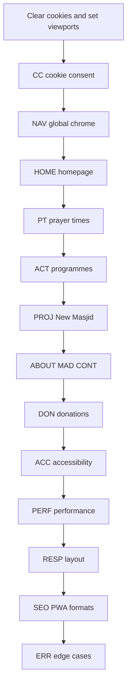

# UAT Test Cases — Tralee Masjid (traleemasjidkicc.ie)

| Field | Value |
|-------|-------|
| **Suite version** | v2.0.3 |
| **Status** | Active |
| **Effective date** | 11 July 2026 |
| **Supersedes** | [v1.0 PDF](../archived/v1.0-pdf-export-2026-06-28.pdf) (72 cases), [v1.1 code audit](../archived/v1.1-code-audit-2026-06-28.md) (141 cases) |
| **Site** | https://traleemasjidkicc.ie |
| **Repository** | https://github.com/traleemasjidkicc/traleemasjidkicc.github.io |
| **Prepared by** | QA consolidation (PDF export + code audit) |
| **Tech stack** | Static HTML/CSS/JS, Bootstrap 4.3, jQuery, Gulp, Cloud Run APIs, Formspree, GoFundMe, SumUp, Mixlr, Google Maps, Google Analytics (consent-gated) |
| **Pages in scope** | `index.html`, `prayer-times.html`, `activities.html`, `projects.html`, `about.html`, `madrasa.html`, `contact.html`, `404.html` |

---

## Overview

The Tralee Masjid website is a static multi-page site for Kerry Islamic Cultural Centre (KICC). There is **no user authentication**. Key visitor flows:

- View daily and monthly prayer (Salah) times with UK date/time formatting
- Navigate via Bootstrap mega-menu navbar and section docks on long pages
- Accept or customise cookie consent before embeds and analytics unlock
- Contact staff via Formspree form, call buttons, and WhatsApp
- Browse programmes, madrasa, about, and New Masjid campaign content
- Donate via GoFundMe, SumUp card checkout, or bank transfer details
- Listen to live or archived audio (Mixlr) when third-party consent is granted

**Breakpoints (Bootstrap 4):** mobile nav below 992px; additional tuning at 768px and 576px.

### UAT environment

| Item | Value |
|------|-------|
| Production URL | `https://traleemasjidkicc.ie` |
| Local URL | `http://localhost:3000` (`yarn start`) |
| Mobile portrait | 390 × 844 (also spot-check 320 × 568) |
| Mobile landscape | 844 × 390 |
| Desktop | 1280 × 800 (also spot-check 1440 × 900) |
| Browsers | Safari iOS, Chrome Android, Edge/Chrome desktop |
| Fresh session | Clear site data / private window for consent tests |
| API dependency | Prayer times, programmes, announcements, campaigns — Cloud Run; use network blocking for failure tests |

### Last execution run

| Field | Value |
|-------|-------|
| **Date** | 11 July 2026 |
| **Environment** | `http://127.0.0.1:3000` (BrowserSync via `yarn start`) |
| **Browser** | Microsoft Edge (Playwright) |
| **Viewports** | 390×844, 844×390, 1280×800 |
| **Command** | `yarn test:e2e` — 154 tests |
| **Automated cases** | 95 ✅ Pass / ⚠️ Partial in Status column below |
| **Pending** | 9 manual / device-only cases — update Status when executed |

### Status legend

| Symbol | Meaning |
|--------|---------|
| ✅ Pass | Meets expected result |
| ❌ Fail | Does not meet expected result |
| ⚠️ Partial | Mostly works with minor issues |
| 💡 Recommendation | Improvement suggested; not a release blocker |
| N/A | Not applicable to this site |

### Column guide

| Column | Description |
|--------|-------------|
| **Priority** | High = pre-sign-off; Medium = important; Low = polish / SEO |
| **Automation** | Playwright spec mapping, or **Manual** |
| **Legacy** | Cross-reference to v1.0 PDF ID and/or v1.1 numeric ID (historical only) |

**ID scheme:** v2.0 prefixed case IDs (e.g. `NAV-04`, `PT-17`) are canonical. Playwright `test()` titles must use these IDs — not legacy `UAT-NNN` numbers.

**Automated regression:** `yarn start` then `yarn test:e2e` (154 Playwright tests in [`tests/`](../../../tests/)).

---

## Navigation (NAV)

| # | Test Case Heading | Device / Orientation | How to Test (Steps) | Expected Result | Priority | Automation | Legacy | Status |
|---|-------------------|----------------------|----------------------|-----------------|----------|------------|--------|--------|
| NAV-01 | Site loads on homepage | Laptop / Desktop | 1. Open site root. 2. Wait for load. | Title contains "Tralee Masjid" or "Kerry Islamic Cultural Centre"; hero and main nav visible; no layout breakage. | High | `homepage.spec.js` | MD-1 | ✅ Pass |
| NAV-02 | Brand logo returns home | Mobile – Portrait | 1. Open any inner page. 2. Tap logo. | Returns to homepage. | Medium | `site-chrome.spec.js` | MD-2 | ✅ Pass |
| NAV-03 | Desktop top nav links visible | Laptop / Desktop | 1. Homepage at ≥992px. 2. Inspect nav. | Programmes, Madrasa, New Masjid, About, Salah times, Donate now visible without hamburger. | High | `mobile-nav.spec.js` | MD-3, N-08 | ✅ Pass |
| NAV-04 | Sticky navbar on scroll | Mobile – Portrait | 1. Accept cookies. 2. Scroll 500px+. 3. Observe nav. | Navbar stays fixed; logo and menu control remain visible. | Medium | `site-chrome.spec.js` | N-01 | ✅ Pass |
| NAV-05 | Mobile hamburger opens menu | Mobile – Portrait | 1. At &lt;992px, tap toggler. | Menu expands; backdrop; body scroll lock; announcement ribbon hidden. | High | `mobile-nav.spec.js` | MD-4, N-02 | ✅ Pass |
| NAV-06 | Hamburger closes with close control | Mobile – Portrait | 1. Open menu. 2. Tap × (close). | Menu collapses; backdrop removed. | Medium | `mobile-nav.spec.js` | N-02 | ✅ Pass |
| NAV-07 | Mobile menu closes on link tap | Mobile – Portrait | 1. Open hamburger. 2. Tap "Madrasa". | Nav collapses; navigates to `madrasa.html`. | High | `mobile-nav.spec.js` | MD-5 | ✅ Pass |
| NAV-08 | Nav behaviour in landscape | Mobile – Landscape | 1. Load at 844×390. 2. Observe nav mode. | Menu usable; no overflow or clipped labels (may show expanded or hamburger per width). | Medium | `mobile-nav.spec.js` | N-03, R-04 | ✅ Pass |
| NAV-09 | Programmes mega menu (desktop) | Laptop / Desktop | 1. Open Programmes mega menu. 2. Follow "This week". | Three columns (Browse, Classes, Listen & Updates); lands on `activities.html#this-week` with scroll offset. | High | `mobile-nav.spec.js` | MD-6, N-05 | ✅ Pass |
| NAV-10 | Programmes mega menu (mobile) | Mobile – Portrait | 1. Open hamburger. 2. Expand Programmes. 3. Tap "Programme guide". | Sub-links accessible; navigates to `activities.html#programme-guide`. | High | `mobile-nav.spec.js` | MD-7, N-04 | ✅ Pass |
| NAV-11 | Mega-menu keyboard navigation | Laptop / Desktop | 1. Tab to Programmes. 2. Enter/Space to open. 3. Arrow through links. 4. Escape. | Dropdown opens; focus moves; Escape closes and returns focus. | Medium | Manual | N-06 | Pending |
| NAV-12 | About mega menu links | Laptop / Desktop | 1. Open About mega menu. 2. Click "Contact us". | Lands on `contact.html` with contact hero visible. | High | `mobile-nav.spec.js` | MD-8 | ✅ Pass |
| NAV-13 | Salah times nav dropdown (mobile) | Mobile – Portrait | 1. Open Salah times in nav. 2. Switch Today/Tomorrow tabs. | Adhan/iqamah rows; UK 12-hour times; PDF link visible; no permanent `—` if API healthy. After midnight, status may show last night's Isha with Fajr next; row badges only on the matching day panel (see NAV-27). | High | `mobile-nav.spec.js` | MD-9, N-07 | ✅ Pass |
| NAV-14 | Salah times nav dropdown (desktop) | Laptop / Desktop | 1. Click Salah times in nav. | Right-aligned panel; Hijri date; sunrise; full timetable and PDF links. After midnight, same row-badge rules as NAV-13. | Medium | `mobile-nav.spec.js` | N-08 | ✅ Pass |
| NAV-15 | Salah times PDF in nav | Laptop / Desktop | 1. Open dropdown. 2. Click monthly PDF. | PDF opens/downloads from Cloud Run URL. | Medium | `mobile-nav.spec.js` | MD-10 | ✅ Pass |
| NAV-16 | Donate now in navbar | All devices | 1. Tap/click Donate now. | GoFundMe donate opens in new tab (`rel="noopener"`). | High | `site-chrome.spec.js` | MD-11, N-09 | ✅ Pass |
| NAV-17 | Active page indicated in nav | Laptop / Desktop | 1. Open `contact.html`. 2. Observe About nav parent. | Current section visually active (`.active` or equivalent). | Medium | `mobile-nav.spec.js` | N-10 | ✅ Pass |
| NAV-18 | Skip to main content | Laptop / Desktop | 1. Tab as first action. 2. Activate skip link. | Focus jumps to `#main-content`, bypassing nav. | High | `site-chrome.spec.js` | N-11, ACC-01 | ✅ Pass |
| NAV-19 | All navbar links resolve | Laptop / Desktop | 1. Click every nav and mega-menu link. | Internal pages load; external links open in new tab. | Medium | Manual | N-12 | Pending |
| NAV-20 | Footer links on all pages | Laptop / Desktop | 1. Visit all 7 main pages. 2. Scroll to footer. | Prayer times, programmes, contact, database link, social links, copyright year current. | Medium | `site-chrome.spec.js` | MD-12 | ✅ Pass |
| NAV-21 | Floating dock — WhatsApp | Mobile – Portrait | 1. Tap WhatsApp in dock. | Opens `wa.me`; no ↗ icon on dock button. | Medium | `site-chrome.spec.js` | MD-13 | ✅ Pass |
| NAV-22 | Floating dock — Donate | Mobile – Portrait | 1. Tap Donate in dock. | Opens GoFundMe donate. | Medium | `site-chrome.spec.js` | MD-14 | ✅ Pass |
| NAV-23 | Back to top | Mobile – Portrait | 1. Scroll deep on `projects.html`. 2. Tap back-to-top. | Smooth scroll to top after threshold. | Low | `site-chrome.spec.js` | MD-15 | ✅ Pass |
| NAV-24 | External link icons on inline links | Laptop / Desktop | 1. Find body-copy external link (e.g. sunnah.com). | ↗ icon shown; buttons/WhatsApp/notices/dock excluded. | Low | Manual | MD-16 | Pending |
| NAV-25 | Sticky offset with announcement ribbon | Mobile – Portrait | 1. With ribbon visible, use section nav on `about.html`. | Section heading not hidden under sticky chrome. | Medium | Manual | MD-17 | Pending |
| NAV-26 | Section nav scroll-spy | Laptop / Desktop | 1. On `prayer-times.html`, scroll Timetable → Jumu'ah → Find us. | Active section highlights in sticky nav. | Medium | Manual | MD-18 | Pending |
| NAV-27 | Post-midnight nav row highlights | Laptop / Desktop | 1. Between midnight and Fajr (mocked or real clock). 2. Open Salah dropdown. 3. Check Today and Tomorrow tabs. | Status chips may show Isha current and Fajr next; Today tab marks Fajr next only; Tomorrow tab has no current/next row badges. | Medium | `nav-salah-midnight.spec.js` | — | ✅ Pass |

---

## Cookie consent and privacy (CC)

| # | Test Case Heading | Device / Orientation | How to Test (Steps) | Expected Result | Priority | Automation | Legacy | Status |
|---|-------------------|----------------------|----------------------|-----------------|----------|------------|--------|--------|
| CC-01 | First-visit cookie banner | Mobile – Portrait | 1. Clear site data. 2. Load homepage. | Banner visible; `cookie-consent-pending`; Accept all and Cookie settings shown; page inert behind gate. | High | `cookie-consent.spec.js` | MD-19, CC-01 | ✅ Pass |
| CC-02 | Accept all enables site | Mobile – Portrait | 1. Fresh session. 2. Accept all. | Banner dismisses; site interactive; consent stored; analytics may load. | High | `cookie-consent.spec.js` | MD-20, CC-02 | ✅ Pass |
| CC-03 | Essential-only blocks embeds | Laptop / Desktop | 1. Fresh session. 2. Disable Third-party embeds; save. 3. Reload Mixlr section. | Mixlr shows paused/consent placeholder; iframe not loaded. | High | `cookie-consent.spec.js` | MD-21, CC-03 | ✅ Pass |
| CC-04 | Cookie settings panel | Mobile – Portrait | 1. Tap Cookie settings on banner. | Preferences dialog with toggles; Strictly Necessary always on. | High | `cookie-consent.spec.js` | CC-04 | ✅ Pass |
| CC-05 | Functional cache toggle | Laptop / Desktop | 1. Disable Functional. 2. Reload prayer times. | Optional cache cleared; fresh fetch attempted. | Medium | `cookie-consent.spec.js` | MD-22 | ✅ Pass |
| CC-06 | Analytics toggle | Laptop / Desktop | 1. Disable Analytics. 2. Check Network for gtag. | GA not loaded until enabled. | Medium | Manual | MD-23 | Pending |
| CC-07 | Preferences persist on reload | Laptop / Desktop | 1. Custom prefs (e.g. analytics on, embeds off). 2. Reload; reopen settings. | Toggles match saved state. | Medium | `cookie-consent.spec.js` | MD-27, CC-05 | ✅ Pass |
| CC-08 | Clear optional stored data | Laptop / Desktop | 1. Accept all. 2. Cookie settings → Clear optional stored data. 3. Reload. | GA cookies cleared; maps/Mixlr behind gate again. | Medium | Manual | CC-06 | Pending |
| CC-09 | No banner on return visit | Mobile – Portrait | 1. Accept all. 2. Close browser. 3. Reopen site. | Banner does not reappear. | Medium | `cookie-consent.spec.js` | CC-07 | ✅ Pass |
| CC-10 | Privacy & cookies footer link | Mobile – Portrait | 1. Footer → Privacy & cookies. | Preferences dialog opens. | Medium | `cookie-consent.spec.js` | CC-08 | ✅ Pass |
| CC-11 | Cookie preferences keyboard | Laptop / Desktop | 1. Open settings. 2. Tab through; Esc. | Focus trapped; toggles operable; closes cleanly. | Medium | Manual | MD-24, ACC-06 | Pending |
| CC-12 | Cookie gate blocks signup modal | Mobile – Portrait | 1. Fresh session (no consent). 2. Observe homepage modal behaviour. | Kerry Muslim database modal blocked until consent. | Medium | Manual | MD-25 | Pending |
| CC-13 | Google Maps consent on contact | Mobile – Portrait | 1. Without third-party consent, open `contact.html#visit-us`. 2. Enable embeds; reload. | Placeholder first; map loads after consent. | High | `cookie-consent.spec.js` | MD-26, CF-12 | ✅ Pass |
| CC-14 | Visitor-friendly privacy copy | Mobile – Portrait | 1. Read banner and preference labels. | Plain language; no developer jargon in visible copy. | Medium | `cookie-consent.spec.js` | MD-28 | ✅ Pass |

---

## Announcements and hadith (ANN)

| # | Test Case Heading | Device / Orientation | How to Test (Steps) | Expected Result | Priority | Automation | Legacy | Status |
|---|-------------------|----------------------|----------------------|-----------------|----------|------------|--------|--------|
| ANN-01 | Announcements ribbon loads | Laptop / Desktop | 1. Accept cookies. 2. Load any page. | Ribbon may show API announcement; `aria-live="polite"`. | Medium | Manual | MD-29 | Pending |
| ANN-02 | Dismiss announcement ribbon | Mobile – Portrait | 1. Dismiss ribbon if shown. | Hides for session. | Low | Manual | MD-30 | Pending |
| ANN-03 | Breaking alert modal | Laptop / Desktop | 1. When breaking alert active, load homepage. | Modal with alert; dismissible; respects reduced motion. | Low | Manual | MD-31 | Pending |
| ANN-04 | Daily hadith on inner pages | Mobile – Portrait | 1. Open `about.html`; scroll to hadith. | Text, narrator, source link from API or fallback. | Low | `about.spec.js` | MD-32 | ✅ Pass |
| ANN-05 | Hadith layout on narrow landscape | Mobile – Landscape | 1. View hadith block at 844×390. | No horizontal overflow; link tappable. | Low | Manual | MD-33 | Pending |

---

## Homepage (HOME)

| # | Test Case Heading | Device / Orientation | How to Test (Steps) | Expected Result | Priority | Automation | Legacy | Status |
|---|-------------------|----------------------|----------------------|-----------------|----------|------------|--------|--------|
| HOME-01 | Hero renders (mobile) | Mobile – Portrait | 1. Accept cookies. 2. View above-the-fold. | Hero readable; no overflow; CTAs tappable without zoom. | Medium | `homepage.spec.js` | H-01 | ✅ Pass |
| HOME-02 | Hero renders (desktop) | Laptop / Desktop | 1. Load at 1280×800. | Full-width hero; headline and CTAs laid out correctly. | Medium | Manual | H-02 | Pending |
| HOME-03 | Hero dates and prayer status | Mobile – Portrait | 1. Read hero area. | Hijri + Gregorian (UK format); seasonal messaging if applicable; prayer status line. | High | `homepage.spec.js` | MD-34 | ✅ Pass |
| HOME-04 | Prayer deck — day navigation | Mobile – Portrait | 1. View prayer deck. 2. Prev/next day; Today. | Times update per day; UK format; graceful empty if API down. | High | `homepage.spec.js` | MD-35, H-03 | ✅ Pass |
| HOME-05 | Next prayer highlighted | Laptop / Desktop | 1. Load between two prayer times. | Upcoming prayer row highlighted or labelled. | Medium | Manual | H-04 | Pending |
| HOME-06 | Prayer deck empty state | Laptop / Desktop | 1. Block Cloud Run; clear cache. 2. Reload. | "Prayer times unavailable." without broken layout. | Medium | `homepage.spec.js` | MD-36 | ✅ Pass |
| HOME-07 | Link to full timetable | Mobile – Portrait | 1. Tap Salah times in Explore hub ("View timetable"). | Navigates to `prayer-times.html`. | High | `homepage.spec.js` | MD-37 | ✅ Pass |
| HOME-08 | Notice board spotlight | Mobile – Portrait | 1. With notices data, tap poster. | BaguetteBox opens; no ↗ on notice links. | Medium | Manual | MD-38 | Pending |
| HOME-09 | Notice board hidden when empty | Laptop / Desktop | 1. Empty notices (API down, no cache). | Section hidden gracefully. | Medium | Manual | MD-39 | Pending |
| HOME-10 | Pillars of Faith tabs | Mobile – Portrait | 1. Tap each of 6 tabs. | Panel switches; one active; touch targets ≥44px. | High | `homepage.spec.js` | MD-40 | ✅ Pass |
| HOME-11 | Pillars of Islam accordion | Mobile – Portrait | 1. Tap each of 5 pillars. | Expands/collapses; readable on small screen. | Medium | `homepage.spec.js` | MD-41 | ✅ Pass |
| HOME-12 | Services We Provide tabs | Laptop / Desktop | 1. Switch Religious / Educational / Social. | Content swaps without overlap. | Low | Manual | MD-42 | Pending |
| HOME-13 | Explore hub links | Mobile – Portrait | 1. Tap each Explore card. | Correct destinations (prayer times, programmes, madrasa, contact, projects). | Medium | `homepage.spec.js` | MD-43 | ✅ Pass |
| HOME-14 | Mixlr live section | Mobile – Portrait | 1. With third-party consent, view Today at the Masjid. | On air/Off air badge; player or archive links. | Medium | Manual | MD-44, A-04 | Pending |
| HOME-15 | Recordings audio player | Laptop / Desktop | 1. Play a recording if listed. | HTML5 audio works; controls accessible. | Low | Manual | MD-45 | Pending |
| HOME-16 | Programmes preview | Mobile – Portrait | 1. Scroll to programmes preview. | Next programme or live card; link to activities. | Medium | Manual | MD-46 | Pending |
| HOME-17 | Homepage donate section | Mobile – Portrait | 1. Scroll to Support Our New Masjid. | GoFundMe progress; SumUp starts on CTA; donate links work. | High | `homepage.spec.js` | MD-47, H-05 | ✅ Pass |
| HOME-18 | Kerry Muslim database modal | Mobile – Portrait | 1. After consent, open modal CTA. 2. Join link. | Plain-language copy; Microsoft Form opens. | Medium | Manual | MD-48 | Pending |
| HOME-19 | Qur'an verse block | Laptop / Desktop | 1. Scroll to Qur'an section. | Arabic + translation; quran.com link works. | Low | `homepage.spec.js` | MD-49 | ✅ Pass |
| HOME-20 | Homepage landscape layout | Mobile – Landscape | 1. Load at 844×390. | Usable without horizontal scroll; nav accessible. | High | `homepage.spec.js` | MD-50, R-04 | ✅ Pass |
| HOME-21 | Very small screen (320px) | Mobile – Portrait | 1. Load at 320px width. | No horizontal scroll; text readable without zoom. | Medium | `responsive.spec.js` | H-07, R-02 | ✅ Pass |
| HOME-22 | Footer copyright year | Laptop / Desktop | 1. Scroll to footer. | © year matches current year via `#footer-year`. | Low | `site-chrome.spec.js` | H-06 | ✅ Pass |

---

## Prayer times (PT)

| # | Test Case Heading | Device / Orientation | How to Test (Steps) | Expected Result | Priority | Automation | Legacy | Status |
|---|-------------------|----------------------|----------------------|-----------------|----------|------------|--------|--------|
| PT-01 | Hero live cards | Mobile – Portrait | 1. Open `prayer-times.html`. | Today/Now/Next cards; UK times; countdown if applicable. | High | `prayer-times.spec.js` | MD-51 | ✅ Pass |
| PT-02 | Month view default on load | Mobile – Portrait | 1. Confirm view on load. | Monthly timetable visible by default; day/week via tabs. | High | `prayer-times.spec.js` | MD-52, PT-01 | ✅ Pass |
| PT-03 | Switch to week view | Mobile – Portrait | 1. Tap Week tab. | Seven-day grid readable; scroll if needed. | High | `prayer-times.spec.js` | MD-53 | ✅ Pass |
| PT-04 | Switch to day view | Laptop / Desktop | 1. Tap Day tab. | Single-day table legible. | Medium | `prayer-times.spec.js` | MD-54 | ✅ Pass |
| PT-05 | Month tabs (current + next) | Mobile – Portrait | 1. Switch month tabs. | Data updates; active tab styled. | High | `prayer-times.spec.js` | MD-55 | ✅ Pass |
| PT-06 | Day picker prev/next/today | Mobile – Portrait | 1. Use day controls. | Timetable updates; UK date chip (e.g. 24 June 2026). | High | `prayer-times.spec.js` | MD-56 | ✅ Pass |
| PT-07 | Print timetable | Laptop / Desktop | 1. Click Print timetable. | Print dialog; branded print sheet. | Medium | `prayer-times.spec.js` (button only) | MD-57 | ⚠️ Partial |
| PT-08 | Download official PDF | Mobile – Portrait | 1. Tap PDF download. | PDF from Cloud Run; no 404. | High | `prayer-times.spec.js` | MD-58, PT-03 | ✅ Pass |
| PT-09 | Jumu'ah section | Mobile – Portrait | 1. Scroll to Jumu'ah via section nav. | Times and notes visible. | High | `prayer-times.spec.js` | MD-59, PT-04 | ✅ Pass |
| PT-10 | Programmes hub footer | Laptop / Desktop | 1. Scroll to More from the masjid. | Programme highlights; links to activities. | Low | Manual | MD-60 | Pending |
| PT-11 | Find us / directions CTAs | Mobile – Portrait | 1. Tap directions/maps in Find us. | Maps or contact as appropriate. | Medium | Manual | MD-61 | Pending |
| PT-12 | URL deep link `?view=month` | Laptop / Desktop | 1. Open `prayer-times.html?view=month`. | Month view loads; shareable URL. | High | `prayer-times.spec.js` | MD-62 | ✅ Pass |
| PT-13 | Reduced motion | Laptop / Desktop | 1. OS reduced motion on. 2. Reload. | Motion reduced; content functional. | Low | Manual | MD-63 | Pending |
| PT-14 | Timetable readability mobile | Mobile – Portrait | 1. Review day view table. | Legible fonts; adequate row height. | Medium | Manual | MD-64, R-02 | Pending |
| PT-15 | Sticky section nav landscape | Mobile – Landscape | 1. Scroll with section nav. | Nav sticks; no overlap. | Medium | Manual | MD-65, PT-05 | Pending |
| PT-16 | Hijri date display | All devices | 1. Load prayer-times page. | Hijri date shown and plausible for today. | Medium | `prayer-times.spec.js` | PT-06 | ✅ Pass |
| PT-17 | Expired iqamah cache fallback | Laptop / Desktop | 1. Seed expired month cache. 2. Open prayer-times. | Fresh API fetch; timetable renders. | High | `prayer-times.spec.js` | — | ✅ Pass |
| PT-18 | Warm cache background refresh | Laptop / Desktop | 1. Seed valid month cache. 2. Open prayer-times. | Cached data shown; background fetch updates. | Medium | `prayer-times.spec.js` | — | ✅ Pass |
| PT-19 | Week view with normalised cache | Mobile – Portrait | 1. Seed month cache with normalised shape. 2. Switch to week view. | Week grid renders UK times. | High | `prayer-times.spec.js` | — | ✅ Pass |
| PT-20 | Nav loading feedback (slow API) | Laptop / Desktop | 1. Clear iqamah cache. 2. Throttle Cloud Run 3s. 3. Open Salah dropdown. | "Loading prayer times…" and shimmer on rows; UK times after load. | High | `prayer-loading.spec.js` | — | ✅ Pass |
| PT-21 | Home deck loading (slow API) | Mobile – Portrait | 1. Clear cache; throttle API. 2. Load homepage. | "Loading prayer times…" in deck; cards or unavailable after load. | High | `prayer-loading.spec.js` | — | ✅ Pass |
| PT-22 | Timetable loading status (slow API) | Mobile – Portrait | 1. Clear cache; throttle API. 2. Open `prayer-times.html`. | "Loading timetable…" status + table shimmer; UK times after load. | High | `prayer-loading.spec.js` | — | ✅ Pass |
| PT-23 | Hero loading placeholders (slow API) | Laptop / Desktop | 1. Clear cache; throttle API. 2. Open prayer-times hero. | Hero shows "Loading…"; `is-loading` clears when data arrives. | Medium | `prayer-loading.spec.js` | — | ✅ Pass |

---

## Programmes / activities (ACT)

| # | Test Case Heading | Device / Orientation | How to Test (Steps) | Expected Result | Priority | Automation | Legacy | Status |
|---|-------------------|----------------------|----------------------|-----------------|----------|------------|--------|--------|
| ACT-01 | This week schedule | All devices | 1. Open `activities.html#this-week`. | Weekly grid from API; today/tomorrow highlighted. | High | `activities.spec.js` | MD-66, A-01 | ✅ Pass |
| ACT-02 | Week scroll carousel | Mobile – Portrait | 1. Scroll weekly grid horizontally. | Smooth; names not clipped. | Low | Manual | MD-67 | Pending |
| ACT-03 | Programme details modal | Mobile – Portrait | 1. Tap interactive programme. | Modal with details; `aria-modal`; Esc closes. | High | `activities.spec.js` | MD-68 | ✅ Pass |
| ACT-04 | Programme guide — adults | Laptop / Desktop | 1. Open Programme guide. | Adult programmes with rhythm copy. | Medium | `activities.spec.js` | MD-69, A-02 | ✅ Pass |
| ACT-05 | Programme guide — madrasa card | Mobile – Portrait | 1. Find madrasa card. | Links to `madrasa.html`; not labelled as database enrolment. | Medium | `activities.spec.js` | MD-70 | ✅ Pass |
| ACT-06 | Women's weekly class | All devices | 1. Navigate to `#womens-weekly-class`. | Schedule, location, contact shown. | Medium | `activities.spec.js` | A-03 | ✅ Pass |
| ACT-07 | Live audio Mixlr embed | Mobile – Portrait | 1. With consent, view Live audio. | Player or Off air; archive links. | Medium | Manual | MD-71, A-04 | Pending |
| ACT-08 | Mixlr behind consent gate | All devices | 1. Decline third-party embeds. 2. Open Live audio. | Consent placeholder, not iframe. | High | `activities.spec.js` | MD-71, A-05 | ✅ Pass |
| ACT-09 | Empty next broadcast | Laptop / Desktop | 1. When no upcoming event. | "No upcoming live broadcast scheduled" or equivalent. | Low | Manual | MD-72 | Pending |
| ACT-10 | Programme filters empty | Laptop / Desktop | 1. Filter to zero results. | "No programmes match your filters." | Low | Manual | MD-73 | Pending |
| ACT-11 | How to join CTAs | Mobile – Portrait | 1. Follow How to join links. | Correct destinations. | Medium | `activities.spec.js` | MD-74 | ✅ Pass |
| ACT-12 | Recordings in landscape | Mobile – Landscape | 1. Play past talk if listed. | Player usable; controls not cut off. | Low | Manual | MD-75 | Pending |
| ACT-13 | External links open new tab | Laptop / Desktop | 1. Click Mixlr archive, database, app links. | `target="_blank"`; site not navigated away. | Medium | `activities.spec.js` | A-06 | ✅ Pass |

---

## New Masjid campaign (PROJ)

| # | Test Case Heading | Device / Orientation | How to Test (Steps) | Expected Result | Priority | Automation | Legacy | Status |
|---|-------------------|----------------------|----------------------|-----------------|----------|------------|--------|--------|
| PROJ-01 | Campaign hero and progress | Mobile – Portrait | 1. Open `projects.html`. | H1 and GoFundMe progress bar visible. | High | `projects.spec.js` | MD-76, P-01 | ✅ Pass |
| PROJ-02 | Section nav seven anchors | Laptop / Desktop | 1. Click each sticky nav item. | Sections scroll with correct offset. | Medium | `projects.spec.js` | MD-77 | ✅ Pass |
| PROJ-03 | Two parts one vision badges | Mobile – Portrait | 1. Read centre vs masjid cards. | In Progress and Planned badges. | Low | `projects.spec.js` | MD-78 | ✅ Pass |
| PROJ-04 | Progress gallery lightbox | Mobile – Portrait | 1. Tap gallery image. | BaguetteBox; swipe; captions readable. | Medium | `projects.spec.js` | MD-79 | ✅ Pass |
| PROJ-05 | Vision blueprint gallery | Laptop / Desktop | 1. Open vision images. | Images load with alt text. | Medium | Manual | MD-80, P-04 | ✅ Pass |
| PROJ-06 | Construction updates | Mobile – Portrait | 1. Scroll to Construction updates. | March 2024 photos; UK dates. | Low | Manual | MD-81 | ✅ Pass |
| PROJ-07 | Funding breakdown | Laptop / Desktop | 1. Read What your donation supports. | Amounts and labels correct (€122k, €150k, etc.). | Medium | `projects.spec.js` | MD-82 | ✅ Pass |
| PROJ-08 | Bank details toggle | Mobile – Portrait | 1. Expand bank transfer details. | IBAN revealed; collapses again. | Medium | `projects.spec.js` | MD-83 | ✅ Pass |
| PROJ-09 | GoFundMe donate links | Mobile – Portrait | 1. Tap donate buttons. | ≥3 GoFundMe donate URLs work. | High | `projects.spec.js` | MD-84 | ✅ Pass |
| PROJ-10 | SumUp widget mount | Laptop / Desktop | 1. Start SumUp; pick amount (no real charge). | Widget mounts; amount picker works. | High | `projects.spec.js` | MD-85, P-03 | ✅ Pass |
| PROJ-11 | SumUp error handling | Laptop / Desktop | 1. Block createCheckout API. | Error panel with retry, reference, WhatsApp. | Medium | `projects.spec.js` | MD-86 | ✅ Pass |
| PROJ-12 | Mobile donate dock | Mobile – Portrait | 1. At 390×844 on projects. | Floating Donate to GoFundMe. | Medium | `projects.spec.js` | MD-87 | ✅ Pass |
| PROJ-13 | Campaign galleries landscape | Mobile – Landscape | 1. Open gallery in landscape. | Images scale; lightbox usable. | Low | Manual | MD-88 | Pending |
| PROJ-14 | Page content readable mobile | Mobile – Portrait | 1. Load projects on narrow width. | No overflow; images scale. | Medium | Manual | P-02 | Pending |

---

## About (ABOUT)

| # | Test Case Heading | Device / Orientation | How to Test (Steps) | Expected Result | Priority | Automation | Legacy | Status |
|---|-------------------|----------------------|----------------------|-----------------|----------|------------|--------|--------|
| ABOUT-01 | Hero stats animation | Laptop / Desktop | 1. Load `about.html`. | Stats animate (1988, 2001, 140+, CHY 14981). | Low | `about.spec.js` | MD-89 | ✅ Pass |
| ABOUT-02 | Timeline and story | Mobile – Portrait | 1. Scroll story sections. | Photos load; readable text. | Medium | `about.spec.js` | MD-90, AB-02 | ✅ Pass |
| ABOUT-03 | Team member cards | Mobile – Portrait | 1. View Our team. | Photos, names, alt text. | Medium | `about.spec.js` | MD-91, AB-01 | ✅ Pass |
| ABOUT-04 | Visit and Connect cards | Laptop / Desktop | 1. Tap maps, contact, programmes cards. | Correct destinations. | Medium | `about.spec.js` | MD-92 | ✅ Pass |
| ABOUT-05 | Support GoFundMe bar | Mobile – Portrait | 1. Scroll Support section. | Progress bar; donate works. | Low | `about.spec.js` | MD-93 | ✅ Pass |
| ABOUT-06 | Section nav scroll-spy | Mobile – Portrait | 1. Use sticky nav across sections. | Active section updates. | Medium | `about.spec.js` | MD-94, AB-03 | ✅ Pass |

---

## Madrasa (MAD)

| # | Test Case Heading | Device / Orientation | How to Test (Steps) | Expected Result | Priority | Automation | Legacy | Status |
|---|-------------------|----------------------|----------------------|-----------------|----------|------------|--------|--------|
| MAD-01 | Hero WhatsApp CTA | Mobile – Portrait | 1. Tap Register on WhatsApp in hero. | WhatsApp with enrolment message. | Medium | `madrasa.spec.js` | MD-95 | ✅ Pass |
| MAD-02 | Class times tables | Mobile – Portrait | 1. Scroll to Class times. | Boys/girls schedules readable. | Medium | `madrasa.spec.js` | MD-96, M-01 | ✅ Pass |
| MAD-03 | Ready to enrol band | Mobile – Portrait | 1. Tap `#ready-to-enrol` CTA. | WhatsApp only — not Microsoft Form. | High | `madrasa.spec.js` | MD-97, M-03 | ✅ Pass |
| MAD-04 | Life With Allah app links | Laptop / Desktop | 1. Tap store links in adhkar section. | Correct App Store / Play URLs. | Low | `madrasa.spec.js` | MD-98 | ✅ Pass |
| MAD-05 | Enrolment copy plain language | Mobile – Portrait | 1. Read enrolment steps. | WhatsApp-only enrolment clear; no jargon. | Medium | `madrasa.spec.js` | MD-99 | ✅ Pass |
| MAD-06 | Madrasa layout mobile / landscape | Mobile – Landscape | 1. View class times in landscape. | Tables usable; nav not overlapping. | Low | `madrasa.spec.js` | MD-100, M-02 | ✅ Pass |

---

## Contact (CONT)

| # | Test Case Heading | Device / Orientation | How to Test (Steps) | Expected Result | Priority | Automation | Legacy | Status |
|---|-------------------|----------------------|----------------------|-----------------|----------|------------|--------|--------|
| CONT-01 | Contact form visible | Mobile – Portrait | 1. Open `contact.html` → Send a message. | Name, Email, Message with labels and submit. | High | `contact-form.spec.js` | MD-101, CF-01 | ✅ Pass |
| CONT-02 | Form empty submit | Laptop / Desktop | 1. Submit empty form. | Inline errors; focus on first invalid field. | High | `contact-form.spec.js` | MD-103, CF-02 | ✅ Pass |
| CONT-03 | Form validation rules | Mobile – Portrait | 1. Short name, bad email, short message. | Min length and format errors with UK examples. | High | `contact-form.spec.js` | MD-104, CF-03–04 | ✅ Pass |
| CONT-04 | Message character counter | Mobile – Portrait | 1. Type in message. | `N / 2000`; `aria-live="polite"`. | Medium | `contact-form.spec.js` | MD-105, CF-05 | ✅ Pass |
| CONT-05 | Valid form submit | Laptop / Desktop | 1. Valid data; submit. | POST to Formspree; success feedback. | High | `contact-form.spec.js` | MD-106, CF-07 | ✅ Pass |
| CONT-06 | Form offline / network error | Laptop / Desktop | 1. DevTools offline. 2. Submit valid form. | Clear error — not blank browser failure page. | Medium | Manual | E-03 | Pending |
| CONT-07 | Imam call buttons | Mobile – Portrait | 1. Tap Call on imam card. | `tel:` opens dialler. | High | `contact-form.spec.js` | MD-101, CF-08 | ✅ Pass |
| CONT-08 | WhatsApp buttons | Mobile – Portrait | 1. Tap WhatsApp on contact page. | WhatsApp with greeting message. | High | `contact-form.spec.js` | CF-09 | ✅ Pass |
| CONT-09 | Directions from my location | Mobile – Portrait | 1. Tap Directions. Allow/deny location. | Maps route or graceful fallback. | Medium | Manual | MD-102, CF-10 | Pending |
| CONT-10 | Open in Google Maps | All devices | 1. Tap Open in Google Maps. | KICC pin in new tab. | Medium | Manual | CF-11 | Pending |
| CONT-11 | Map embed after consent | Mobile – Portrait | 1. Enable third-party embeds. 2. View Visit us. | Google Maps iframe; correct address. | High | Manual | MD-108, CF-13 | Pending |
| CONT-12 | Contact section nav | Mobile – Portrait | 1. Tap each section nav item. | Smooth scroll; active link updates. | Medium | `contact-form.spec.js` | MD-107, CF-14 | ✅ Pass |
| CONT-13 | Section nav docks on scroll | Laptop / Desktop | 1. Scroll past hero. | Sticky section nav; spy updates. | Medium | Manual | CF-15 | Pending |
| CONT-14 | Arabic greeting RTL | All devices | 1. View Arabic text in contact hero. | RTL rendering; correct glyphs; `lang="ar"`. | Medium | Manual | CF-16 | Pending |

---

## Donations cross-page (DON)

| # | Test Case Heading | Device / Orientation | How to Test (Steps) | Expected Result | Priority | Automation | Legacy | Status |
|---|-------------------|----------------------|----------------------|-----------------|----------|------------|--------|--------|
| DON-01 | Campaign API fallback | Laptop / Desktop | 1. Block `getcampaigns`. 2. Reload campaign bar. | Fallback title; not perpetual loading. | Medium | Manual | MD-109 | Pending |
| DON-02 | PayPal link on projects | Mobile – Portrait | 1. Tap PayPal in Ways to donate. | PayPal short link opens. | Low | Manual | MD-110 | Pending |
| DON-03 | SumUp on homepage | Mobile – Portrait | 1. Homepage donate — start SumUp. | Sandbox checkout opens with hosted card fields. | High | `sumup.spec.js` | MD-111 | ✅ Pass |
| DON-04 | Donation copy clarity | Laptop / Desktop | 1. Read donation sections. | Clear: GoFundMe vs card vs bank transfer. | Medium | Manual | MD-112 | Pending |
| DON-05 | SumUp sandbox ribbon | Laptop / Desktop | 1. Start SumUp on localhost. | Sandbox ribbon and test-mode styling shown. | High | `sumup.spec.js` | — | ✅ Pass |
| DON-06 | SumUp hosted fields | Laptop / Desktop | 1. Open SumUp checkout. | Cardholder, number, expiry, and CVV fields mount. | High | `sumup.spec.js` | — | ✅ Pass |
| DON-07 | SumUp sandbox success | Laptop / Desktop | 1. Pay €10 with Visa test card `4200000000000091`. | Success message with amount; no error panel. | High | `sumup.spec.js` | — | ✅ Pass |
| DON-08 | SumUp sandbox decline | Laptop / Desktop | 1. Pay custom €11 with test card. | Error panel with retry; no success state. | High | `sumup.spec.js` | — | ✅ Pass |
| DON-09 | SumUp error retry | Laptop / Desktop | 1. After declined payment, tap Try again. | Error clears; checkout can reopen. | Medium | `sumup.spec.js` | — | ✅ Pass |
| DON-10 | SumUp consent gate | Laptop / Desktop | 1. Accept essential cookies only. 2. Open donate. | Consent notice; start button disabled; no widget. | High | `sumup.spec.js` | — | ✅ Pass |

---

## Accessibility (ACC)

| # | Test Case Heading | Device / Orientation | How to Test (Steps) | Expected Result | Priority | Automation | Legacy | Status |
|---|-------------------|----------------------|----------------------|-----------------|----------|------------|--------|--------|
| ACC-01 | Page language `en-GB` | Laptop / Desktop | 1. Inspect `html` on any page. | `lang="en-GB"`. | High | `homepage.spec.js` | MD-113, ACC-08 | ✅ Pass |
| ACC-02 | Keyboard nav — main nav | Laptop / Desktop | 1. Tab through nav. | Visible focus; Enter activates. | High | `homepage.spec.js` | MD-114 | ✅ Pass |
| ACC-03 | Keyboard — programme modal | Laptop / Desktop | 1. Open modal; Tab; Esc. | Focus trapped; Esc closes. | Medium | Manual | MD-115 | Pending |
| ACC-04 | Screen reader — salah panel | Laptop / Desktop | 1. VoiceOver/NVDA on Salah dropdown. | Tablist and sr-only labels announced. | Medium | Manual | MD-116 | Pending |
| ACC-05 | Image alt text | Mobile – Portrait | 1. Sample 10 images sitewide. | Meaningful alt; decorative `alt=""`. | Medium | Manual | MD-117, ACC-02 | Pending |
| ACC-06 | Colour contrast — body text | Laptop / Desktop | 1. Contrast tool on body copy. | WCAG AA (≥4.5:1). | High | Manual | MD-118, ACC-04 | Pending |
| ACC-07 | Colour contrast — teal buttons | Laptop / Desktop | 1. Check `.btn-kicc` on `#0a8a8e`. | ≥4.5:1 or flag if borderline. | Medium | Manual | ACC-05 | Pending |
| ACC-08 | Touch target size | Mobile – Portrait | 1. Nav toggler, dock, faith tabs. | Targets ≥44×44px where feasible. | High | `mobile-nav.spec.js` | MD-119, R-03 | ✅ Pass |
| ACC-09 | Form labels and errors | Laptop / Desktop | 1. Inspect contact form. | `<label for>`; errors `role="alert"`. | High | `contact-form.spec.js` | MD-120, ACC-03 | ✅ Pass |
| ACC-10 | Reduced motion — faith pillars | Laptop / Desktop | 1. Reduced motion on; interact with pillars. | Animations minimised; usable. | Low | Manual | MD-121 | Pending |
| ACC-11 | Icon-only link labels | Laptop / Desktop | 1. Footer social; nav icon buttons. | `aria-label` on icon-only controls. | Low | Manual | ACC-07 | Pending |

---

## Performance and loading (PERF)

| # | Test Case Heading | Device / Orientation | How to Test (Steps) | Expected Result | Priority | Automation | Legacy | Status |
|---|-------------------|----------------------|----------------------|-----------------|----------|------------|--------|--------|
| PERF-01 | First contentful paint (Fast 3G) | Mobile – Portrait | 1. Throttle Fast 3G. 2. Load homepage. | Hero/nav appear quickly; usable within ~5s. | Medium | Manual | MD-122, PF-01 | Pending |
| PERF-02 | API cache resilience | Laptop / Desktop | 1. Load online. 2. Offline reload. | Cached prayer/programmes/hadith from storage. | Medium | Manual | MD-123 | Pending |
| PERF-03 | Progress bar loading state | Mobile – Portrait | 1. Slow network on projects. | Loading then resolve or fallback. | Low | Manual | MD-124 | Pending |
| PERF-04 | CDN assets with SRI | Laptop / Desktop | 1. View source for CDN scripts. | `integrity` and `crossorigin` present. | Low | Manual | MD-125, PF-03 | Pending |
| PERF-05 | No console errors (happy path) | Laptop / Desktop | 1. Load each page with consent. | No uncaught JS errors. | Medium | Manual | MD-126, PF-04 | Pending |
| PERF-06 | Image lazy loading | Mobile – Portrait | 1. Scroll campaign galleries. | Below-fold images load on scroll. | Low | Manual | MD-127, PF-02 | Pending |

---

## Responsiveness and layout (RESP)

| # | Test Case Heading | Device / Orientation | How to Test (Steps) | Expected Result | Priority | Automation | Legacy | Status |
|---|-------------------|----------------------|----------------------|-----------------|----------|------------|--------|--------|
| RESP-01 | No horizontal scroll sitewide | Mobile – Portrait | 1. Each page at 375px. | No page-level horizontal scrollbar. | High | `responsive.spec.js` | R-01 | ✅ Pass |
| RESP-02 | Text readable without zoom | Mobile – Portrait | 1. Homepage without pinch-zoom. | Body ≥16px equivalent; headings clear. | High | `responsive.spec.js` | R-02 | ✅ Pass |
| RESP-03 | Footer columns on mobile | Mobile – Portrait | 1. Footer on mobile. | Columns stack; links visible; donate full-width. | Medium | Manual | R-05 | Pending |
| RESP-04 | Mega-menu on tablet landscape | Mobile – Landscape | 1. Open Programmes mega-menu. | Columns side-by-side or stacked; nothing clipped. | Medium | Manual | R-06 | Pending |
| RESP-05 | Theme colour on mobile browser | Mobile – Portrait | 1. Observe browser chrome / add to home screen. | `theme-color` `#0a8a8e` from manifest. | Low | Manual | R-07, MD-132 | Pending |
| RESP-06 | Cross-device nav label consistency | Mobile vs Desktop | 1. Compare nav labels. | Programmes, New Masjid, Salah times consistent; database not "Register". | Medium | Manual | MD-133 | Pending |

---

## SEO, PWA, and formats (SEO)

| # | Test Case Heading | Device / Orientation | How to Test (Steps) | Expected Result | Priority | Automation | Legacy | Status |
|---|-------------------|----------------------|----------------------|-----------------|----------|------------|--------|--------|
| SEO-01 | Unique page titles | Laptop / Desktop | 1. Open all 7 main pages. | Unique descriptive `<title>` each. | Medium | `seo.spec.js` | MD-128 | ✅ Pass |
| SEO-02 | Canonical URLs | Laptop / Desktop | 1. View canonical on 2+ pages. | `https://traleemasjidkicc.ie/...` | Medium | `seo.spec.js` | MD-129, SEO-01 | ✅ Pass |
| SEO-03 | Open Graph / Twitter cards | Laptop / Desktop | 1. Inspect meta tags. | og:title, description, image per page. | Low | `seo.spec.js` | MD-130, SEO-02 | ✅ Pass |
| SEO-04 | Structured data valid | Laptop / Desktop | 1. Rich Results Test on sample pages. | Mosque/WebPage/BreadcrumbList valid. | Low | Manual | SEO-03 | Pending |
| SEO-05 | sitemap.xml | Laptop / Desktop | 1. Open `/sitemap.xml`. | All public HTML pages listed. | Medium | `seo.spec.js` | MD-131, SEO-04 | ✅ Pass |
| SEO-06 | robots.txt | Laptop / Desktop | 1. Open `/robots.txt`. | Allows crawl; references sitemap. | Low | `seo.spec.js` | SEO-05 | ✅ Pass |
| SEO-07 | Add to Home Screen (iOS) | Mobile – Portrait | 1. Safari → Add to Home Screen. | Icon and name from `site.webmanifest`. | Low | Manual | MD-132 | Pending |
| SEO-08 | UK date format sitewide | Laptop / Desktop | 1. Dates on prayer, programmes, hero. | Day before month (e.g. 24 June 2026). | High | `prayer-times.spec.js` | MD-134 | ✅ Pass |
| SEO-09 | UK time format sitewide | Mobile – Portrait | 1. Iqamah in nav and deck. | 12-hour, lowercase am/pm, no leading zero on hour. | High | `prayer-times.spec.js` | MD-135 | ✅ Pass |

---

## Error states and edge cases (ERR)

| # | Test Case Heading | Device / Orientation | How to Test (Steps) | Expected Result | Priority | Automation | Legacy | Status |
|---|-------------------|----------------------|----------------------|-----------------|----------|------------|--------|--------|
| ERR-01 | Branded 404 page | Laptop / Desktop | 1. Visit nonexistent path on production. | Branded `404.html` with nav and helpful links. | High | `errors.spec.js` | MD-136, E-01 | ✅ Pass |
| ERR-02 | Invalid hash anchor | Mobile – Portrait | 1. Open `about.html#nonexistent`. | Page loads; no JS crash. | Low | `errors.spec.js` | MD-137 | ✅ Pass |
| ERR-03 | Prayer API total failure | Mobile – Portrait | 1. Block Cloud Run; clear cache; reload. | Nav shows "Prayer times unavailable right now."; no infinite spinners. | Medium | `errors.spec.js` | MD-138, E-02 | ✅ Pass |
| ERR-04 | Mixlr API failure | Laptop / Desktop | 1. Block api.mixlr.com. | Off air / fallback; page usable. | Medium | `errors.spec.js` | MD-139 | ✅ Pass |
| ERR-05 | Empty recordings list | Mobile – Portrait | 1. When no recordings. | Hidden or empty state; no broken player. | Low | Manual | MD-140 | Pending |
| ERR-06 | Maps consent placeholder copy | Mobile – Portrait | 1. Decline embeds; open contact map. | Styled placeholder with Privacy & cookies link — not blank. | Medium | `errors.spec.js` | E-04 | ✅ Pass |

---

## Authentication (AUTH)

| # | Test Case Heading | Device / Orientation | How to Test (Steps) | Expected Result | Priority | Automation | Legacy | Status |
|---|-------------------|----------------------|----------------------|-----------------|----------|------------|--------|--------|
| AUTH-01 | No user login on site | Laptop / Desktop | 1. Search pages for login/account. | No authentication flows; public site only. | N/A | Manual | MD-141 | N/A |

---

## Summary

### Execution summary (11 July 2026)

| Metric | Count |
|--------|-------|
| **Total test cases** | **112** |
| ✅ Pass (automated or verified) | 94 |
| ⚠️ Partial (automated subset) | 1 |
| Pending (manual / device) | 9 |
| N/A | 1 |

### Priority breakdown

| Metric | Count |
|--------|-------|
| High priority | 43 |
| Medium priority | 44 |
| Low priority | 16 |

### Section counts

| Section | Prefix | Cases |
|---------|--------|-------|
| Navigation | NAV | 26 |
| Cookie consent | CC | 14 |
| Announcements | ANN | 5 |
| Homepage | HOME | 22 |
| Prayer times | PT | 23 |
| Programmes | ACT | 13 |
| New Masjid | PROJ | 14 |
| About | ABOUT | 6 |
| Madrasa | MAD | 6 |
| Contact | CONT | 14 |
| Donations | DON | 4 |
| Accessibility | ACC | 11 |
| Performance | PERF | 6 |
| Responsiveness | RESP | 6 |
| SEO / formats | SEO | 9 |
| Error states | ERR | 6 |
| Authentication | AUTH | 1 |

### Recommended execution order




### Playwright inventory (v2.0.2)

Playwright test titles use **v2.0 prefixed IDs** (e.g. `NAV-01`, `PT-17`). The **Legacy** column in case tables is historical only.

| Spec file | UAT prefixes | Tests |
|-----------|--------------|-------|
| `about.spec.js` | ABOUT-01–06, ANN-04 | 7 |
| `activities.spec.js` | ACT-01, ACT-03–06, ACT-08, ACT-11, ACT-13 | 8 |
| `contact-form.spec.js` | CONT-01–05, CONT-07–08, CONT-12, ACC-09 | 9 |
| `cookie-consent.spec.js` | CC-01–05, CC-07, CC-09–10, CC-13–14 | 10 |
| `errors.spec.js` | ERR-01–04, ERR-06 | 5 |
| `homepage.spec.js` | NAV-01, HOME-01, HOME-03–04, HOME-06–07, HOME-10–11, HOME-13, HOME-17, HOME-19–20, ACC-01–02 | 14 |
| `prayer-loading.spec.js` | PT-20–23 | 4 |
| `madrasa.spec.js` | MAD-01–06 | 6 |
| `mobile-nav.spec.js` | NAV-03, NAV-05–10, NAV-12–15, NAV-17, NAV-08, ACC-08 | 13 |
| `nav-salah-midnight.spec.js` | NAV-27 | 1 |
| `prayer-times.spec.js` | PT-01–09, PT-12, PT-16–19, SEO-08–09 | 16 |
| `projects.spec.js` | PROJ-01–12 | 13 |
| `responsive.spec.js` | RESP-01–02, HOME-21 | 3 |
| `seo.spec.js` | SEO-01–03 (×7 pages), SEO-05–06 | 23 |
| `site-chrome.spec.js` | NAV-02, NAV-04, NAV-16, NAV-18, NAV-20–23, HOME-22 | 9 |
| `sumup.spec.js` | DON-03, DON-05–10 | 7 |
| **Total** | | **154** |

Shared helpers: `tests/helpers/site.js` (`gotoWithViewport`, `acceptAllCookies`, `openCookieSettings`, `blockCloudRun`, `blockMixlr`, `visitAllPublicPages`, etc.), `tests/helpers/sumup.js` (sandbox checkout, hosted fields, payment outcomes).


### Manual follow-up (pending cases)

- **Real devices:** Safari iOS, Chrome Android — Add to Home Screen (SEO-07), touch ergonomics, geolocation (CONT-09)
- **Payment completion:** SumUp sandbox success/decline/retry — automated in `sumup.spec.js` (DON-05–10); PROJ-11 covers checkout API failure
- **API failure paths:** Block Cloud Run / Mixlr (HOME-06, ERR-03–05, DON-01) — DevTools network blocking
- **Print dialog:** PT-07 — verify print sheet visually
- **Accessibility:** VoiceOver/NVDA (ACC-04), contrast audit (ACC-06–07), reduced motion (PT-13, ACC-10)
- **Performance:** Fast 3G (PERF-01), offline cache (PERF-02)

### How to re-run automation

```bash
yarn start          # terminal 1 — http://localhost:3000
yarn test:e2e       # terminal 2 — all 154 tests
yarn test:e2e:headed  # watch in Edge
```

When manual cases are executed, update the **Status** column in this file and bump suite minor version per [README](../README.md).

### Consolidation notes (v1.0 + v1.1 → v2.0)

| Source | Kept from PDF (v1.0) | Kept from code audit (v1.1) |
|--------|------------------------|-----------------------------|
| Structure | Metadata header, section prefixes, priority summary, audit issues | Environment table, Playwright mapping, wider page coverage |
| Unique additions | Skip link, sticky nav, hamburger × close, active nav state, Arabic RTL, women's class, responsiveness section, contact offline error | Prayer deck, notices, faith/islam pillars, campaign depth, auth N/A, branded 404 (resolved) |
| Deduplicated | Merged overlapping cookie, contact, and nav cases into single best wording | Reduced duplicate device variants where one case suffices |

### Critical issues (audit — track in sprint)

1. **Cookie gate hard dependency** — CDN/consent script failure leaves site inert; consider timeout fallback.
2. **Bootstrap 4.3 / jQuery age** — plan upgrade path.
3. **CDN single point of failure** — consider self-hosting critical assets.
4. ~~**Prayer times loading feedback**~~ — **Resolved** — loading states for nav, home deck, hero, and timetable (PT-20–23).
5. **Formspree limits** — monitor submission quota on contact form.
6. **Arabic RTL on contact** — verify Safari iOS and older Android.
7. ~~**Custom 404**~~ — **Resolved** in repository (`404.html`, `403.html`, `500.html`).

### Changelog

| Version | Date | Change |
|---------|------|--------|
| v2.0.4 | 12 Jul 2026 | Post-midnight nav Salah row highlights (NAV-27); 154 Playwright tests |
| v2.0.3 | 11 Jul 2026 | Prayer times loading UI (PT-20–23); HOME-06 and ERR-03 automated; SumUp sandbox e2e (DON-05–10); 153 Playwright tests |
| v2.0.2 | 11 Jul 2026 | Expanded Playwright suite (142 tests); PT-17–19 cache cases; automation mappings refreshed |
| v2.0.1 | 28 Jun 2026 | Merged execution results into Status column; removed separate results file |
| v2.0 | 28 Jun 2026 | Consolidated PDF (72) + code audit (141) → 100 cases; versioned under `docs/tests/` |
| v1.1 | 28 Jun 2026 | Code audit expansion (archived) |
| v1.0 | 28 Jun 2026 | Initial PDF export (archived) |
