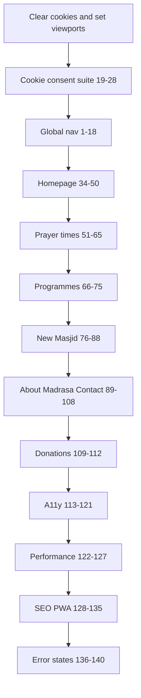

# UAT Test Cases — Tralee Masjid (v1.1 archive)

**Suite version:** v1.1  
**Status:** Archived — superseded by [v2.0](../active/uat-suite-v2.0-2026-06-28.md)  
**Source:** Code audit export (28 June 2026) — 141 test cases  

---

**Application type:** Static GitHub Pages site for Kerry Islamic Cultural Centre — no user authentication, no server-side forms (contact uses Formspree; donations use GoFundMe/SumUp third parties).

**Pages:** [`index.html`](index.html), [`prayer-times.html`](prayer-times.html), [`activities.html`](activities.html), [`projects.html`](projects.html), [`about.html`](about.html), [`madrasa.html`](madrasa.html), [`contact.html`](contact.html)

**Key dynamic behaviour:** Single app script [`assets/js/scripts-*.js`](assets/js/scripts-1782609670001.js) — cache-then-fetch from Cloud Run APIs; consent gating for Mixlr, Maps, analytics, functional cache.

**Existing automated tests:** Playwright suite in [`tests/`](../../tests/) — 55 tests. Outcomes recorded in [active UAT suite Status column](../active/uat-suite-v2.0-2026-06-28.md).

**Breakpoints (Bootstrap 4):** Mobile nav below 992px; additional tuning at 768px and 576px.

**Authentication:** Not applicable — no login, logout, or registration on this site.

---

## UAT environment setup

| Item | Value |
|------|-------|
| URL | `https://traleemasjidkicc.ie` (or `http://localhost:3000` via `yarn start`) |
| Mobile Portrait | 390 × 844 |
| Mobile Landscape | 844 × 390 |
| Laptop / Desktop | 1280 × 800 (also spot-check 1440 × 900) |
| Browsers | Safari iOS, Chrome Android, Edge/Chrome desktop (match Playwright: Edge) |
| Fresh session | Clear site data / use private window for cookie-consent tests |
| API dependency | Prayer times, programmes, announcements require Cloud Run; use network throttling for loading-state tests |

**Status legend:** Leave blank as **—** during UAT execution unless tester records ✅ Pass, ❌ Fail, ⚠️ Partially Passing, or 💡 Recommendation. Pre-audit **💡 Recommendation** entries are flagged from code review only.

---

## Global navigation and chrome

| # | Test Case Heading | Device / Orientation | How to Test (Steps) | Expected Result | Status |
|---|-------------------|----------------------|----------------------|-----------------|--------|
| 1 | Site loads on homepage | Laptop / Desktop | 1. Open `https://traleemasjidkicc.ie/`. 2. Wait for page load. | Page title contains "Tralee Masjid" or "Kerry Islamic Cultural Centre"; hero and nav visible; no layout breakage. | — |
| 2 | Brand logo returns home | Mobile – Portrait | 1. Navigate to any inner page. 2. Tap logo in top-left nav. | Returns to homepage (`/` or `index.html`). | — |
| 3 | Desktop top nav links visible | Laptop / Desktop | 1. On homepage at ≥992px width. 2. Inspect nav items. | Programmes, Madrasa, New Masjid, About, Salah times, Donate now visible without hamburger. | — |
| 4 | Mobile hamburger opens menu | Mobile – Portrait | 1. At &lt;992px, tap nav toggler. | Menu expands; backdrop appears; body gets scroll lock (`kicc-nav-open`); announcement ribbon hidden. | — |
| 5 | Mobile menu closes on link tap | Mobile – Portrait | 1. Open hamburger. 2. Tap "Madrasa". | Nav collapses; navigates to `madrasa.html`. | — |
| 6 | Programmes mega menu (desktop) | Laptop / Desktop | 1. Hover/click Programmes. 2. Follow "This week" link. | Mega menu opens with three columns; link lands on `activities.html#this-week` with correct scroll offset. | — |
| 7 | Programmes mega menu (mobile) | Mobile – Portrait | 1. Open hamburger. 2. Expand Programmes section. 3. Tap "Programme guide". | Sub-links accessible; navigates to `activities.html#programme-guide`. | — |
| 8 | About mega menu links | Laptop / Desktop | 1. Open About mega menu. 2. Click "Contact us". | Lands on `contact.html` with contact hero visible. | — |
| 9 | Salah times nav dropdown | Mobile – Portrait | 1. Tap "Salah times" in nav. 2. Switch Today/Tomorrow tabs. | Dropdown shows adhan/iqamah rows; tab switch updates content; times in UK 12-hour format (e.g. `4:30 pm`). | — |
| 10 | Salah times PDF link in nav | Laptop / Desktop | 1. Open Salah times dropdown. 2. Click monthly PDF link. | Opens/downloads monthly timetable PDF from Cloud Run URL. | — |
| 11 | Donate now nav button | Mobile – Landscape | 1. Tap "Donate now" in nav. | Opens GoFundMe donate URL in new tab (`rel="noopener"`). | — |
| 12 | Footer links on all pages | Laptop / Desktop | 1. Visit each of 7 pages. 2. Scroll to footer. | Footer shows prayer times, programmes, contact, database link, copyright year (current year), social links. | — |
| 13 | Floating action dock — WhatsApp | Mobile – Portrait | 1. On any page, locate bottom-right dock. 2. Tap WhatsApp. | Opens `wa.me` with masjid number; no external ↗ icon on dock button. | — |
| 14 | Floating action dock — Donate | Mobile – Portrait | 1. Tap Donate in dock. | Opens GoFundMe donate page. | — |
| 15 | Back to top button | Mobile – Portrait | 1. Scroll deep into `projects.html`. 2. Tap back-to-top. | Smooth scroll to top; button visible after scroll threshold. | — |
| 16 | External link icons on inline links | Laptop / Desktop | 1. Find body-copy external link (e.g. sunnah.com on About). | ↗ icon appended; buttons/WhatsApp/notice links excluded per rules. | — |
| 17 | Sticky nav offset with announcement ribbon | Mobile – Portrait | 1. Accept cookies. 2. If announcement ribbon visible, tap section nav link on `about.html`. | Target section heading not hidden under sticky nav; scroll lands with comfortable margin. | — |
| 18 | Section nav dock scroll-spy | Laptop / Desktop | 1. On `prayer-times.html`, scroll through Timetable → Jumu'ah → Find us. | Sticky section nav highlights active section; indicator animates. | — |

---

## Cookie consent and privacy

| # | Test Case Heading | Device / Orientation | How to Test (Steps) | Expected Result | Status |
|---|-------------------|----------------------|----------------------|-----------------|--------|
| 19 | First-visit cookie banner | Mobile – Portrait | 1. Clear site data. 2. Load homepage. | Cookie banner appears; page has `cookie-consent-pending`; Accept all and Cookie settings visible. | — |
| 20 | Accept all enables embeds | Mobile – Portrait | 1. Fresh session. 2. Tap Accept all. 3. Scroll to Mixlr on homepage. | Banner dismisses; Mixlr embed loads (or shows Off air); consent stored in `kicc-cookie-consent`. | — |
| 21 | Reject / essential-only blocks Mixlr | Laptop / Desktop | 1. Fresh session. 2. Open Cookie settings; disable Third-party embeds. 3. Save. 4. Reload homepage Mixlr section. | Shows "Stream paused" or consent placeholder; iframe not loaded. | — |
| 22 | Functional cache toggle | Laptop / Desktop | 1. Disable Functional in preferences. 2. Reload and check prayer times. | Cached API data cleared; fresh fetch attempted; behaviour documented in preferences copy. | — |
| 23 | Analytics toggle | Laptop / Desktop | 1. Disable Analytics. 2. Check Network tab for gtag. | GA not loaded until analytics enabled. | — |
| 24 | Cookie preferences modal keyboard | Laptop / Desktop | 1. Open Cookie settings. 2. Tab through controls; Esc to close. | Focus trapped in dialog; toggles operable; modal closes cleanly. | — |
| 25 | Cookie gate blocks Kerry Muslim modal | Mobile – Portrait | 1. Fresh session (no consent). 2. Trigger homepage database modal if auto-shown. | Modal blocked until consent given (`activateCookieConsentGate`). | — |
| 26 | Google Maps consent on contact | Mobile – Portrait | 1. Without third-party consent, open `contact.html#visit-us`. | Map shows consent placeholder, not embedded map. 2. Enable third-party → map loads. | — |
| 27 | Preferences persist across pages | Laptop / Desktop | 1. Set custom preferences on homepage. 2. Navigate to `activities.html`. | Same consent state; no re-prompt unless cleared. | — |
| 28 | Privacy copy is visitor-friendly | Mobile – Portrait | 1. Read cookie banner and preferences labels. | No developer jargon (API, cache, embed) in visible copy per site rules. | — |

---

## Announcements and hadith

| # | Test Case Heading | Device / Orientation | How to Test (Steps) | Expected Result | Status |
|---|-------------------|----------------------|----------------------|-----------------|--------|
| 29 | Announcements ribbon loads | Laptop / Desktop | 1. Accept cookies. 2. Load any page. | Ribbon may appear below nav with announcement text from API; `aria-live="polite"`. | — |
| 30 | Dismiss announcement ribbon | Mobile – Portrait | 1. If ribbon shown, tap dismiss. | Ribbon hides for session; reappears on new session if still active server-side. | — |
| 31 | Breaking alert modal | Laptop / Desktop | 1. When breaking alert configured, load homepage. | Modal appears with alert content; dismissible; respects reduced motion. | — |
| 32 | Daily hadith on inner pages | Mobile – Portrait | 1. Open `about.html`. 2. Scroll to hadith section. | Hadith text, narrator, and source link load from API or fallback. | — |
| 33 | Hadith UK-readable layout | Mobile – Landscape | 1. View hadith block on narrow landscape. | Text wraps; no horizontal overflow; link tappable. | — |

---

## Homepage

| # | Test Case Heading | Device / Orientation | How to Test (Steps) | Expected Result | Status |
|---|-------------------|----------------------|----------------------|-----------------|--------|
| 34 | Hero date and prayer status | Mobile – Portrait | 1. Load homepage. 2. Read hero area. | Hijri + Gregorian dates shown (UK date format); Ramadan/Eid messaging if in season; prayer status line updates. | — |
| 35 | Prayer deck carousel — today | Mobile – Portrait | 1. View prayer deck. 2. Tap prev/next day. 3. Tap Today. | Adhan/iqamah times update per day; zawaal highlighted when applicable; UK times. | — |
| 36 | Prayer deck empty state | Laptop / Desktop | 1. Block Cloud Run APIs + clear cache. 2. Reload homepage deck. | Shows "Prayer times unavailable." without broken layout. | — |
| 37 | Link to full timetable | Mobile – Portrait | 1. Tap "View full timetable" (or equivalent) in deck area. | Navigates to `prayer-times.html`. | — |
| 38 | Notice board spotlight | Mobile – Portrait | 1. With notices API data, view notice section. 2. Tap a notice poster. | BaguetteBox lightbox opens; poster image scales; no ↗ on notice links. | — |
| 39 | Notice board hidden when empty | Laptop / Desktop | 1. Simulate empty notices (API down, no cache). | Notice board section hidden gracefully. | — |
| 40 | Pillars of Faith tabs | Mobile – Portrait | 1. Tap each of 6 faith tabs. | Content panel switches; only one active; touch targets ≥44px. | — |
| 41 | Pillars of Islam expand/collapse | Mobile – Portrait | 1. Tap each of 5 pillars. | Accordion expands/collapses; readable on small screen. | — |
| 42 | Services We Provide tabs | Laptop / Desktop | 1. Switch Religious / Educational / Social tabs. | Tab content swaps; no overlap or clipped text. | — |
| 43 | Explore hub links | Mobile – Portrait | 1. Tap each card in "Everything in one place". | Correct page opens (prayer times, programmes, madrasa, contact, projects). | — |
| 44 | Mixlr live section | Mobile – Portrait | 1. With third-party consent, view "Today at the Masjid". | Live badge On air/Off air; embed or player visible; archive links work. | — |
| 45 | Recordings audio player | Laptop / Desktop | 1. If recordings exist, play a recording. | HTML5 audio plays; play/pause state clear; `aria-pressed` on controls. | — |
| 46 | Programmes preview / next up | Mobile – Portrait | 1. Scroll to programmes preview. | Next programme or live event card from API; link to full programmes page. | — |
| 47 | Homepage donate section | Mobile – Portrait | 1. Scroll to Support Our New Masjid. | GoFundMe progress bar animates; SumUp widget visible; donate CTA works. | — |
| 48 | Kerry Muslim database modal | Mobile – Portrait | 1. After consent, open modal from homepage CTA. 2. Tap Join link. | Modal shows plain-language "Kerry Muslim database" copy; opens Microsoft Form. | — |
| 49 | Homepage Qur'an verse block | Laptop / Desktop | 1. Scroll to Qur'an verse section. | Arabic + translation readable; link to quran.com works. | — |
| 50 | Homepage layout landscape | Mobile – Landscape | 1. Load homepage at 844×390. | Hero and prayer deck usable without horizontal scroll; nav accessible. | — |

---

## Prayer times page

| # | Test Case Heading | Device / Orientation | How to Test (Steps) | Expected Result | Status |
|---|-------------------|----------------------|----------------------|-----------------|--------|
| 51 | Page hero live cards | Mobile – Portrait | 1. Open `prayer-times.html`. | Today/Now/Next cards show with countdown; UK times. | — |
| 52 | Month view default on load | Mobile – Portrait | 1. Confirm default view on load. | Month timetable visible (default view is Monthly); day/week available via tabs. | — |
| 53 | Switch to week view | Mobile – Portrait | 1. Tap Week tab. | Seven-day grid; readable columns; horizontal scroll if needed without breaking layout. | — |
| 54 | Switch to month view | Laptop / Desktop | 1. Tap Month tab. | Full month grid; month name in UK format. | — |
| 55 | Month tabs (current + next) | Mobile – Portrait | 1. Tap next month tab. 2. Return to current month. | Data switches; active tab styled. | — |
| 56 | Day picker prev/next/today | Mobile – Portrait | 1. Use prev day, next day, Today controls. | Timetable updates; date chip shows UK format (e.g. 24 June 2026). | — |
| 57 | Print timetable | Laptop / Desktop | 1. Click Print timetable. | Print dialog opens; print sheet shows masjid branding and prayer table. | — |
| 58 | Download official PDF | Mobile – Portrait | 1. Tap PDF download button. | PDF opens/downloads from Cloud Run. | — |
| 59 | Jumu'ah section | Mobile – Portrait | 1. Scroll to Jumu'ah section via sticky nav. | Jumu'ah times and any dynamic announcement slot visible. | — |
| 60 | Programmes hub footer | Laptop / Desktop | 1. Scroll to "More from the masjid". | Programme highlights from API; links to activities page. | — |
| 61 | Find us / directions CTAs | Mobile – Portrait | 1. Tap directions or maps links in Find us. | Opens Google Maps or contact page as appropriate. | — |
| 62 | URL deep link `?view=month` | Laptop / Desktop | 1. Open `prayer-times.html?view=month`. | Month view loads directly; shareable URL works. | — |
| 63 | Prayer times reduced motion | Laptop / Desktop | 1. Enable `prefers-reduced-motion: reduce` in OS. 2. Reload page. | Hero motion reduced/disabled; content still functional. | — |
| 64 | Timetable readability mobile | Mobile – Portrait | 1. Review day view table. | Font sizes legible; no text truncation on prayer names; adequate row height. | — |
| 65 | Sticky section nav on prayer page | Mobile – Landscape | 1. Scroll with section nav visible. | Nav sticks below main nav; links don't overlap content. | — |

---

## Programmes (activities)

| # | Test Case Heading | Device / Orientation | How to Test (Steps) | Expected Result | Status |
|---|-------------------|----------------------|----------------------|-----------------|--------|
| 66 | Weekly schedule grid | Mobile – Portrait | 1. Open `activities.html#this-week`. | API-built schedule; today/tomorrow highlighted; Jumu'ah banner if applicable. | — |
| 67 | Week scroll carousel | Mobile – Portrait | 1. Swipe/scroll weekly grid horizontally if applicable. | Smooth scroll; no clipped programme names. | — |
| 68 | Programme details modal | Mobile – Portrait | 1. Tap a programme card. | Modal opens with title, time, speaker, venue; `aria-modal`; close button works. | — |
| 69 | Programme guide — adult programmes | Laptop / Desktop | 1. Navigate to Programme guide. | Adult programmes section with rhythm copy and links. | — |
| 70 | Programme guide — madrasa card | Mobile – Portrait | 1. Find children's madrasa card. | Links to `madrasa.html`; does not label database form as enrolment. | — |
| 71 | Live audio Mixlr embed | Mobile – Portrait | 1. With consent, view Live audio section. | Mixlr player loads; next broadcast card shows date in UK format or empty state. | — |
| 72 | Empty next broadcast | Laptop / Desktop | 1. When no upcoming event, view Live audio. | "No upcoming live broadcast scheduled" shown. | — |
| 73 | Programme filters empty state | Laptop / Desktop | 1. Apply filters yielding no results. | "No programmes match your filters." message shown. | — |
| 74 | How to join CTAs | Mobile – Portrait | 1. Follow contact, notices, madrasa links in How to join. | Each lands on correct destination. | — |
| 75 | Recordings section | Mobile – Landscape | 1. Play a past talk if listed. | Audio player usable in landscape; controls not cut off. | — |

---

## New Masjid campaign (projects)

| # | Test Case Heading | Device / Orientation | How to Test (Steps) | Expected Result | Status |
|---|-------------------|----------------------|----------------------|-----------------|--------|
| 76 | Campaign hero and progress bar | Mobile – Portrait | 1. Open `projects.html`. | H1 "Help Us Complete the House of Allah"; GoFundMe progress bar visible and animates. | — |
| 77 | Section nav seven anchors | Laptop / Desktop | 1. Click each sticky nav link (Opening message → Ways to donate). | Each section scrolls into view with correct offset. | — |
| 78 | Two parts one vision badges | Mobile – Portrait | 1. Read Community Centre vs Main Masjid cards. | "In Progress" and "Planned" badges visible. | — |
| 79 | Progress photo gallery lightbox | Mobile – Portrait | 1. Tap gallery image in Progress so far. | BaguetteBox opens; swipe between images; captions readable. | — |
| 80 | Vision blueprint gallery | Laptop / Desktop | 1. Open images in The vision. | 6 gallery captions; images load (`naturalWidth > 0`). | — |
| 81 | Construction updates March 2024 | Mobile – Portrait | 1. Scroll to Construction updates. | March 2024 photos visible with dates in UK style. | — |
| 82 | Funding breakdown amounts | Laptop / Desktop | 1. Read What your donation supports. | Qardh Hasanah, Car Park, Main Masjid; €122k, €150k visible. | — |
| 83 | Bank details toggle | Mobile – Portrait | 1. In Ways to donate, expand bank transfer details. | IBAN/account details revealed; toggle collapses again. | — |
| 84 | GoFundMe donate links | Mobile – Portrait | 1. Tap primary donate buttons. | ≥3 links to GoFundMe donate URL open correctly. | — |
| 85 | SumUp widget mount | Laptop / Desktop | 1. Scroll to SumUp section. 2. Click "Donate with SumUp". 3. Select amount (do not complete real payment). | Widget mounts; amount picker works; card form area appears. | — |
| 86 | SumUp error handling UI | Laptop / Desktop | 1. Simulate checkout failure (network block on Firebase). | Error panel with retry, copy reference, WhatsApp support link. | — |
| 87 | Campaign page mobile donate dock | Mobile – Portrait | 1. At 390×844 on projects page. | Floating Donate button visible; links to GoFundMe. | — |
| 88 | Campaign galleries landscape | Mobile – Landscape | 1. Open gallery on landscape phone. | Images scale; lightbox usable. | — |

---

## About page

| # | Test Case Heading | Device / Orientation | How to Test (Steps) | Expected Result | Status |
|---|-------------------|----------------------|----------------------|-----------------|--------|
| 89 | Hero stats animation | Laptop / Desktop | 1. Load `about.html`. | Stats (1988, 2001, 140+, CHY 14981) animate into view. | — |
| 90 | Timeline and story sections | Mobile – Portrait | 1. Scroll Our Story and How We Evolved. | Photos load; text readable; no overflow. | — |
| 91 | Team member cards | Mobile – Portrait | 1. View Our Team section. | Imam/management/trustee photos and names display; images have alt text. | — |
| 92 | Visit and Connect cards | Laptop / Desktop | 1. Tap maps, contact, programmes cards. | Correct destinations. | — |
| 93 | Support section GoFundMe bar | Mobile – Portrait | 1. Scroll to Support Our Masjid. | Progress bar matches other pages; donate buttons work. | — |
| 94 | About section nav scroll-spy | Mobile – Portrait | 1. Use sticky nav from Who we are to Our team. | Active section updates; smooth scroll. | — |

---

## Madrasa page

| # | Test Case Heading | Device / Orientation | How to Test (Steps) | Expected Result | Status |
|---|-------------------|----------------------|----------------------|-----------------|--------|
| 95 | Hero WhatsApp CTA | Mobile – Portrait | 1. Open `madrasa.html`. 2. Tap hero Register on WhatsApp. | Opens WhatsApp with pre-filled enrolment message. | — |
| 96 | Class times tables | Mobile – Portrait | 1. Scroll to Class times. | Boys/girls schedule tables readable; may scroll horizontally on narrow screens. | — |
| 97 | Ready to enrol band | Mobile – Portrait | 1. Tap CTA at `#ready-to-enrol`. | WhatsApp deep link opens; not Microsoft Form. | — |
| 98 | Life With Allah app links | Laptop / Desktop | 1. Tap App Store / Google Play in adhkar section. | Correct store URLs open. | — |
| 99 | Madrasa copy — no jargon | Mobile – Portrait | 1. Read enrolment steps. | Plain language; WhatsApp-only enrolment clear. | — |
| 100 | Madrasa landscape layout | Mobile – Landscape | 1. View class times in landscape. | Tables usable; section nav not overlapping content. | — |

---

## Contact page

| # | Test Case Heading | Device / Orientation | How to Test (Steps) | Expected Result | Status |
|---|-------------------|----------------------|----------------------|-----------------|--------|
| 101 | Imam contact cards | Mobile – Portrait | 1. Open `contact.html`. 2. Tap Call and WhatsApp on imam cards. | `tel:` and WhatsApp links open native apps. | — |
| 102 | Directions from my location | Mobile – Portrait | 1. Tap Directions from my location. 2. Allow/deny location. | With permission: opens maps with route; without: graceful fallback. | — |
| 103 | Contact form — empty submit | Laptop / Desktop | 1. Submit form with all fields empty. | Inline errors: name, email, message required; focus moves to first invalid field. | — |
| 104 | Contact form — validation rules | Mobile – Portrait | 1. Enter name "Ab", invalid email, message &lt;20 chars. 2. Blur each field. | Errors: min 3 char name, valid email format, min 20 char message with count. | — |
| 105 | Message character counter | Mobile – Portrait | 1. Type in message field. | Counter updates (`N / 2000`); `aria-live="polite"`. | — |
| 106 | Contact form — valid submit | Laptop / Desktop | 1. Fill valid name, email, message (≥20 chars). 2. Submit. | Form POSTs to Formspree; success/thank-you from Formspree (or redirect). | — |
| 107 | Contact section nav | Mobile – Portrait | 1. Use Reach the right person / Visit us / Send a message links. | Correct sections scroll into view. | — |
| 108 | Map embed after consent | Mobile – Portrait | 1. Enable third-party cookies. 2. View Visit us map. | Google Maps iframe loads; address matches Killerisk Business Centre. | — |

---

## Donations (cross-page)

| # | Test Case Heading | Device / Orientation | How to Test (Steps) | Expected Result | Status |
|---|-------------------|----------------------|----------------------|-----------------|--------|
| 109 | GoFundMe progress API fallback | Laptop / Desktop | 1. Block `getcampaigns` API. 2. Reload page with campaign bar. | Fallback campaign title shown; bar not stuck in perpetual loading. | — |
| 110 | PayPal donate link (projects) | Mobile – Portrait | 1. On projects Ways to donate, tap PayPal. | Opens PayPal short link. | — |
| 111 | SumUp on homepage | Mobile – Portrait | 1. Homepage donate section — start SumUp flow. | Same widget behaviour as projects page; amount selection works. | — |
| 112 | Donation copy accessibility | Laptop / Desktop | 1. Read donation sections. | Clear distinction: GoFundMe campaign vs card payment vs bank transfer. | — |

---

## Accessibility

| # | Test Case Heading | Device / Orientation | How to Test (Steps) | Expected Result | Status |
|---|-------------------|----------------------|----------------------|-----------------|--------|
| 113 | Page language | Laptop / Desktop | 1. Inspect `html` on any page. | `lang="en-GB"`. | — |
| 114 | Keyboard nav — main nav | Laptop / Desktop | 1. Tab through top nav links. | Visible focus ring; all links reachable; Enter activates. | — |
| 115 | Keyboard — programme modal | Laptop / Desktop | 1. Open programme modal. 2. Tab and Esc. | Focus trapped in modal; Esc closes; focus returns. | — |
| 116 | Screen reader — salah panel | Laptop / Desktop | 1. Use VoiceOver/NVDA on Salah times dropdown. | Tablist roles announced; sr-only labels on times. | — |
| 117 | Image alt text | Mobile – Portrait | 1. Sample 10 images across pages. | Meaningful `alt` on content images; decorative marked appropriately. | — |
| 118 | Colour contrast — primary buttons | Laptop / Desktop | 1. Check Donate / primary CTAs with contrast tool. | Meets WCAG AA (4.5:1 text). | — |
| 119 | Touch target size — mobile CTAs | Mobile – Portrait | 1. Measure tap areas for nav toggler, dock buttons, faith tabs. | Targets ≥44×44px where feasible. | — |
| 120 | Form labels associated | Laptop / Desktop | 1. Inspect contact form fields. | Each input has `<label for=...>`; errors use `role="alert"`. | — |
| 121 | Reduced motion — faith pillars | Laptop / Desktop | 1. OS reduced motion on. 2. Interact with homepage pillars. | Animations minimised; content still usable. | — |

---

## Performance and loading states

| # | Test Case Heading | Device / Orientation | How to Test (Steps) | Expected Result | Status |
|---|-------------------|----------------------|----------------------|-----------------|--------|
| 122 | First contentful paint | Mobile – Portrait | 1. Throttle to Fast 3G. 2. Load homepage. | Static hero/nav appear quickly; no long blank screen. | — |
| 123 | API cache resilience | Laptop / Desktop | 1. Load site online. 2. Go offline. 3. Reload. | Cached prayer times/programmes/hadith show from localStorage. | — |
| 124 | Progress bar loading class | Mobile – Portrait | 1. Hard refresh on projects with slow network. | GoFundMe bar shows loading state then resolves or fallback. | — |
| 125 | CDN assets with SRI | Laptop / Desktop | 1. View page source for Bootstrap/jQuery scripts. | `integrity` and `crossorigin` attributes present. | — |
| 126 | No console errors on happy path | Laptop / Desktop | 1. Load each page with consent accepted. | No uncaught JS errors in console during normal browsing. | — |
| 127 | Image lazy loading behaviour | Mobile – Portrait | 1. Scroll campaign galleries. | Below-fold images load as scrolled; no broken image icons. | — |

---

## SEO, PWA, and cross-page consistency

| # | Test Case Heading | Device / Orientation | How to Test (Steps) | Expected Result | Status |
|---|-------------------|----------------------|----------------------|-----------------|--------|
| 128 | Unique page titles | Laptop / Desktop | 1. Open all 7 pages; check browser tab title. | Each page has unique descriptive `<title>`. | — |
| 129 | Canonical URLs | Laptop / Desktop | 1. View source canonical on 2 pages. | Points to `https://traleemasjidkicc.ie/...` | — |
| 130 | Open Graph / Twitter cards | Laptop / Desktop | 1. Validate with sharing debugger or view meta tags. | `og:title`, `og:description`, `og:image` present per page. | — |
| 131 | sitemap.xml | Laptop / Desktop | 1. Open `/sitemap.xml`. | Lists all 7 public HTML pages. | — |
| 132 | Add to Home Screen (iOS) | Mobile – Portrait | 1. Safari → Share → Add to Home Screen. | Icon and name "Tralee Masjid" / KICC from [`site.webmanifest`](site.webmanifest); theme colour `#0a8a8e`. | — |
| 133 | Cross-device nav label consistency | Mobile – Landscape vs Laptop | 1. Compare nav labels on same pages. | "Programmes", "New Masjid", "Salah times" consistent; Kerry Muslim database not labelled "Register". | — |
| 134 | UK date format sitewide | Laptop / Desktop | 1. Check dates on prayer times, programmes, hero. | Day before month (e.g. 24 June 2026); never US order. | — |
| 135 | UK time format sitewide | Mobile – Portrait | 1. Check iqamah times in nav and deck. | 12-hour, lowercase am/pm, no leading zero on hour. | — |

---

## Error pages and empty states

| # | Test Case Heading | Device / Orientation | How to Test (Steps) | Expected Result | Status |
|---|-------------------|----------------------|----------------------|-----------------|--------|
| 136 | 404 for unknown URL | Laptop / Desktop | 1. Visit `https://traleemasjidkicc.ie/nonexistent-page.html` (after deploy). | Branded `404.html` with site nav, helpful links, and requested path shown. | — |
| 137 | Invalid hash anchor | Mobile – Portrait | 1. Open `about.html#nonexistent-section`. | Page loads; no JS crash; user not stuck. | — |
| 138 | API total failure — prayer nav | Mobile – Portrait | 1. Block all Cloud Run; clear cache; reload. | Nav salah panel degrades gracefully; no infinite spinners. | — |
| 139 | Mixlr API failure | Laptop / Desktop | 1. Block api.mixlr.com. | Shows Off air; page remains usable. | — |
| 140 | Empty recordings list | Mobile – Portrait | 1. When no recordings returned. | Recordings section hidden or empty state; no broken player. | — |

---

## Authentication (not applicable)

| # | Test Case Heading | Device / Orientation | How to Test (Steps) | Expected Result | Status |
|---|-------------------|----------------------|----------------------|-----------------|--------|
| 141 | No user login on site | Laptop / Desktop | 1. Search all pages for login/register/account. | No authentication flows; public informational site only. | N/A |

---

## Summary

### Totals

| Metric | Count |
|--------|-------|
| **Total UAT test cases** | **141** |
| Mobile – Portrait | 58 |
| Mobile – Landscape | 12 |
| Laptop / Desktop | 71 |
| N/A (authentication) | 1 |
| Pre-audit Recommendations | 1 |

### Recommended priorities

**High (execute before production sign-off)**
- Cookie consent gating and embed behaviour (19–27)
- Prayer times accuracy and UK formats (9, 34–37, 51–58, 134–135)
- Mobile navigation and touch targets (4–5, 119)
- Contact form validation and submission (103–106)
- Donation flows — GoFundMe links and SumUp mount (84–86, 109–111)
- Programme modal and weekly schedule (66–68)
- Homepage prayer deck and notices (35–39)
- Accessibility keyboard and forms (114–116, 120)

**Medium**
- Section nav scroll-spy across long pages (18, 59, 77, 94, 107)
- Mixlr live audio and recordings (44–45, 71–72, 75)
- Campaign galleries and bank details (79–83)
- API cache/offline resilience (123, 138–139)
- Cross-page consistency (133–135)
- SEO/PWA metadata (128–132)

**Low**
- Motion/reduced-motion polish (63, 121)
- External link icon rules (16)
- Breaking alert modal when configured (31)

### Critical issues from code audit (pre-UAT execution)

1. **Automated regression suite** — Playwright now covers high-priority flows; extend for API-failure and device-only cases as needed.
2. **Third-party dependency** — Core value (prayer times, programmes, donations) depends on Cloud Run, Mixlr, GoFundMe, SumUp, Formspree; UAT must include API-down scenarios.
3. **No end-user authentication** — By design; not a defect.
4. **Payment completion** — SumUp card checkout cannot be fully UAT-tested without test cards / sandbox; limit to widget mount and error UI (85–86).

### Suggested UAT execution order

